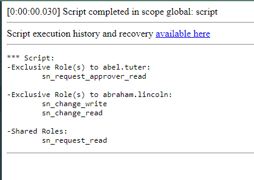

# Compare Roles of Two Users
Provide the usernames of two users and this script will print out the roles they share and the roles they don't share.

## Usage
Run script in **compare-roles-2-users.js** in Scripts - Background

* **Parameters:** 
    - **include_inherited_roles:**
      - False - only directly assigned roles
      - True - roles inherited from other roles or groups
    - **username_a:** Unsername of a sys_user
    - **username_b:** Unsername of a sys_user

## Example Result

