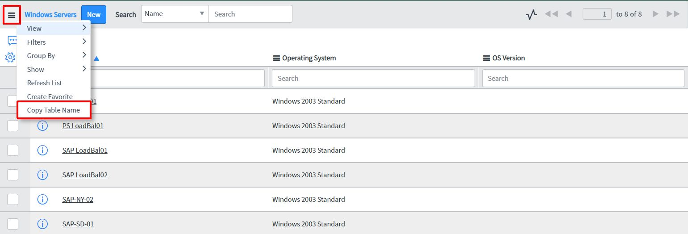

# Add "Copy Table Name" menu item to the List context
* **Description:** This background script programmatically adds a menu item to any list context menu that will copy the respective table name of that list.

    >
**Example:** In this case, clicking the "Copy Table Name" menu item will copy ```cmdb_ci_win_server``` to your clipboard
* **Usage:** 
    - **addMenuItem.js:** Run this background script to add the menu item to the list context menu.
    - **removeMenuItem.js:** Run this background script to remove a previously added menu item.