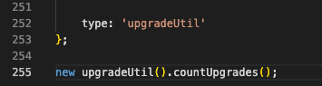
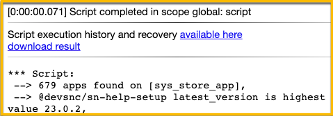
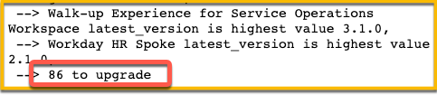
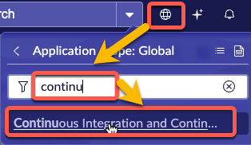
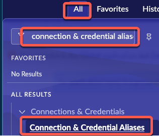
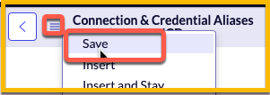
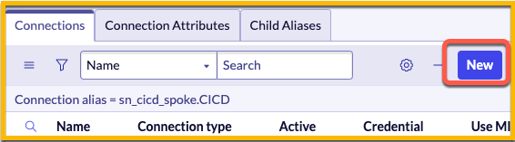
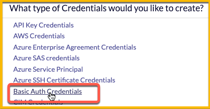
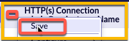
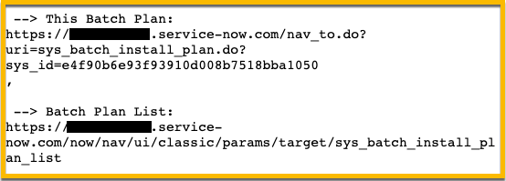

# Update All Store Apps

## Introduction

Would you like to upgrade all of your installed plugins and store apps at the same time?  This script include can be used as a background script to allow you to do just that. 

It uses a feature called Batch Plans[^1] included with the out of the box CICD API[^2] to allow you to batch up multiple applications for installations at once. 

Batch Plans are only accessible by sending REST commands with a JSON payload to the CICD API. The examples below use the CICD API on the same instance where the script is running, but theoretically you could call a remote instance with the correct credentials and upgrade all plugins and/or store apps on it. 

The script can utilize hard-coded credentials (*less secure, but easier*) or a Connection & Credential Alias[^3] (*very secure, but a few more steps to set up*)

# Instructions

# Step 1: Get ready to run the script

***Go to System Definition > Scripts - Background***

At the bottom of the page, switch your scope to **Global**.


# Step 2: Copy and paste the script

Copy the entire script and paste into the background script window.

# Step 3: Run the script

Scroll to the bottom of the background script window. 

Select one of the options below to run.

1. [Find out how many apps are available to upgrade](#option-1-find-out-how-many-apps-are-available-to-upgrade)

2. [Upgrade all apps by hard-coding a username and password](#option-2-upgrade-all-apps-by-hard-coding-a-username-and-password) (*Less secure*)

3. [Upgrade all apps using a Connection & Credential Alias](#option-3-upgrade-all-apps-using-a-connection--credential-alias) (*More secure*)

    1. [Setup Connection & Credential Alias](#section-a-setup-connection--credential-alias)
    2. [Regular usage after initial setup of Connection & Credential Alias](#section-b-regular-usage-after-initial-setup-of-connection--credential-alias)

## OPTION 1: Find out how many apps are available to upgrade

1. ***Replace the last line by pasting this line at the bottom of the script.***

    ```javascript
    new upgradeUtil().countUpgrades();
    ```

    

2. ***Click the "Run script" button.***

    ### 
    

    *All apps that can be upgraded are displayed along with their version number.*

    *In the example below ...*

    * *679 apps total are installed*

    * *The app **@devsnc/sn-help-setup** can be upgraded to the version **23.0.2**.*

3. ***Scroll to the bottom of the page to see the total number of apps to be upgraded.***

    


## OPTION 2: Upgrade all apps by hard-coding a username and password

> [!WARNING]
> <strong>Option 2</strong> will expose the credentials in the System Log on your instance. Do not use this method if you do not want to expose these in the System Log. Any user with the *admin* role will be able to view these credentials in the log.
> <strong>YOU HAVE BEEN WARNED.</strong>


<table>
  <tr>
    <td><b>Difficulty:</b></td>
    <td>Easy</td>
  </tr>
  <tr>
    <td><b>Security:</b></td>
    <td>Low</td>
  </tr>
</table>

1. ***Paste this line at the bottom of the script.***

    ```javascript
    upgradeUtil.upgradeAllAvailable('admin', 'password');
    ```

    Update **password** to the password of the user **admin**.

    You may also use a different user instead of **admin** but the user must have the *admin* role. 


2. ***Click the "Run script" button.***


## OPTION 3: Upgrade all apps using a Connection & Credential Alias 

<table>
  <tr>
    <td><b>Difficulty:</b></td>
    <td>Medium</td>
  </tr>
  <tr>
    <td><b>Security:</b></td>
    <td>High</td>
  </tr>
</table>

### SECTION A: Setup Connection & Credential Alias

> [!IMPORTANT]
> You only need to complete SECTION A the first time you use the script on your instance.
> After that, the Credential is configured and does not need to be defined again so you can skip straight to [SECTION B](#option-3-section-b) for any other time you run the script after the first time.

1. ***Change your Application Scope to "Continuous Integration and Continuous Delivery (CICD) Spoke"***

    

1. ***Go to All >> Connections & Credentials >> Connection & Credential Aliases***

    

1. ***Open the record where Name is "CICD".***

1. ***Change the "Type" to "Connection & Credential".***

    

1. ***Click the context menu hamburger button and Save the record.***

    

1. ***Click the **New** button in the Credentials related list.***

    

1. ***Select Basic Auth Credentials.***

    

1. ***Complete the form with the following values, then click Submit.***

    | Field | Value | Description |
    |--|--|--|
    | **Name**| admin@myInstanceName | This field is a *description* of the HTTP Connection. A good syntax to use is the name of the account '@' the name of the instance.  
    | **Connection URL** | `http://example.service-now.com` | The URL of your ServiceNow instance. Please do not put the value literally as `http://example.service-now.com`.

1. ***Click the context menu hamburger button and Save the record.***

1. ***Click the reference field icon next to the field Credential.***

    

1. ***Click New.***

    

1. ***Select 'Basic Auth Credentials'.***

1. ***Complete the form with the following values, then click Submit.***

    | Field | Value | Description |
    |--|--|--|
    | **Name**| admin@myInstanceName | This field is a *description* of the credential. A good syntax to use is the name of the account '@' the name of the instance.  
    | **User name** | `admin` | This is the User that the script will log in to the instance with. 
    | **Password** | `password` | This is the password for the User specified above. After you save the record, the dots in the field will be shorter than the actual password. This is normal to prevent users from knowing the actual length of the password.

1. ***Click the context menu hamburger button and Save the record.***

    

### SECTION B: Regular usage after initial setup of Connection & Credential Alias

1. ***Go to System Definition > Scripts - Background***

1. ***Paste this line at the bottom of the script.***

    ```javascript
    upgradeUtil.upgradeAllAvailable('alias','752a91887740001038e286a2681061fb');
    ```

   *In this scenario, the script will use a Connection Alias with the sys_id `752a91887740001038e286a2681061fb`.*

1. ***Click the "Run script" button.***


## Review the Batch Plan

Once you have ran the script with either Option 2 or Option 3, you will get output about the Batch Plan that was generated. 

Batch Plans do not have a Navigation Module on the All menu so these URLs are provided to help you get to the Batch Plan quicker. 



**This Batch Plan (Example)**: 

`https://myInstanceName.service-now.com/nav_to.do?uri=sys_batch_install_plan.do?sys_id=e4f90b6e93f93910d008b7518bba1050`

Copy and paste the URL from the output of the script into a browser tab to view the Batch Plan you just submitted. You may need to be patient and refresh the page occasionally to see the changes made as the Plan is built and executed. 

**Batch Plan List (Example):**

`https://myInstanceName.service-now.com/now/nav/ui/classic/params/target/sys_batch_install_plan_list`

Copy and paste this URL from the output of the script into a browser tab to view the list of all Batch Plans.


[^1]: **Product Docs: Install multiple applications in a batch:** [https://docs.servicenow.com/csh?topicname=cicd-spoke-batch-install.html&version=latest](https://docs.servicenow.com/csh?topicname=cicd-spoke-batch-install.html&version=latest)

[^2]:**Product Docs: Continuous Integration/Continuous Delivery (CICD) API:** [https://docs.servicenow.com/csh?topicname=cicd-api.html&version=latest](https://docs.servicenow.com/csh?topicname=cicd-api.html&version=latest)

[^3]:**Product Docs: Create a Connection & Credential alias:** [https://docs.servicenow.com/csh?topicname=connection-alias.html&version=latest](https://docs.servicenow.com/csh?topicname=connection-alias.html&version=latest)
