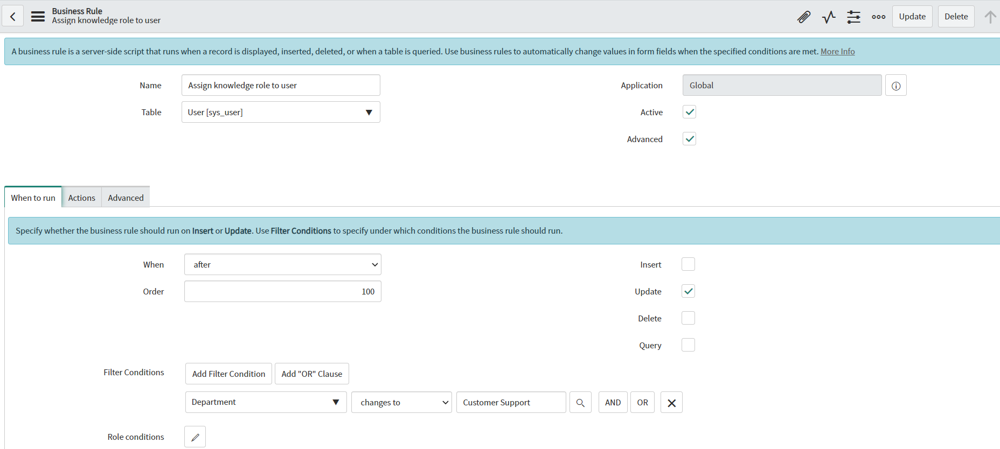
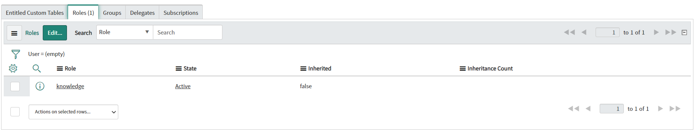

**Business Rule**

Script to *automatically assign* a *specific role* on creation or update of users, with additional protection against duplication of roles. You can run that Business Rules based on your needs (on user creation or on update when specific field was changed). To assign different role, copy sys_id of chose role into ROLE_ID variable.

**Example configuration of Business Rule**

**Example execution effect**

