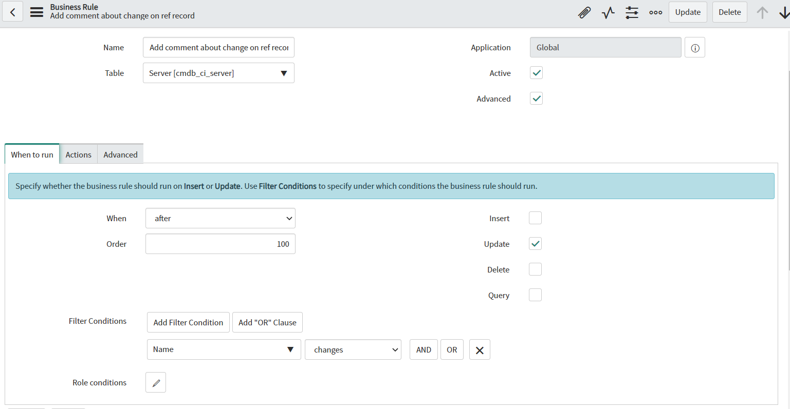

**Business Rule**

 Script which allows adding comments to referenced records after some insert or update was made. In this example, after changing name on a Configuration Item, all incident which have that Ci  assigned will get comment about that change. You can change the script to different table, query and conditions to fit your needs.

 **Example configuration of  Business Rule** 

**Example effect of execution**

