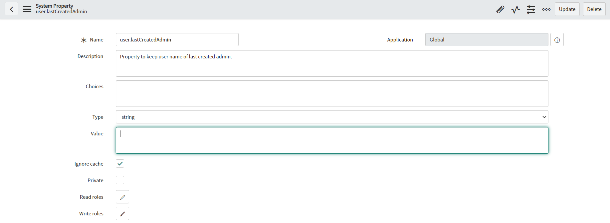
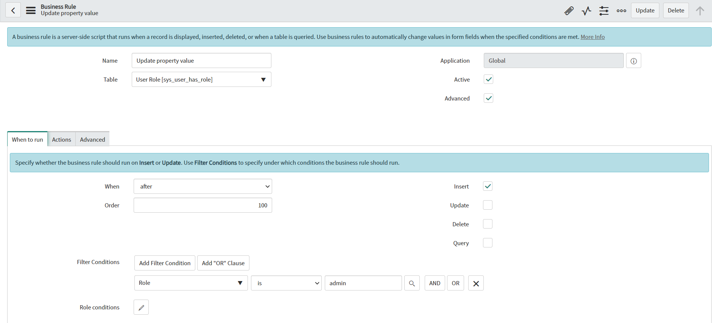
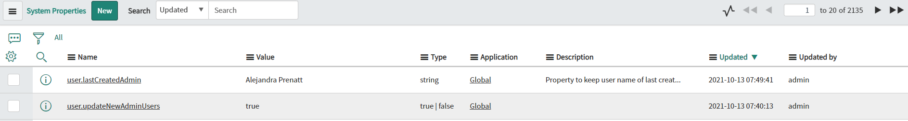

**Business Rule**

Script which allows *getting value of specific system property and manipulate these values*. In this example, true/false property is got to determine if script should be executed. Then value of system property which is keeping last created user which gets 'admin' role is updated.

**Create new system property**

Before you can get or manipulate custom system property you need to create it in [sys_properties] table. Below you can see example of created property:

**Example configuration of Business Rule**

**Example execution effect**

