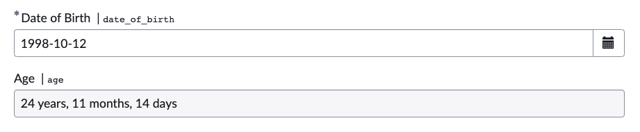

# Age Calculator - On Change Client Script

This script is designed to calculate a person's age based on their date of birth.

## Functions

- `calculateAge(dateOfBirth)`: Calculates the age in years, months, and days based on the provided date of birth.
- `calculateAgeDifference(startDate, endDate)`: Computes the difference in years, months, and days between two dates.

## Sample Input and Output

