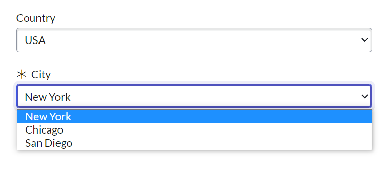

## Load / Populate the options for the second dropdown field (select box) based on what user chooses in the first dropdown

### Use case

You need to dynamically populate the options for a dropdown (select box) field following another field.

For example, you need to create a catalog that has 2 fields: country and city, when the user chooses a country, the city field will only show the cities of that country.

This will especially come in handy when you have hundreds of options to populate, and easier to maintain than using catalog UI policies 👍

### Set up

- On the catalog, create 2 select box fields, for example: `city` and `country`
- Add the question choices for the 1st dropdown
- In the 2nd dropdwon, add any value for the question choices to bypass the mandatory
- Create new client script, on change, for the FIRST dropdown. Only applies on Catalog Item view. It is recommended to set the variables readonly on the RITM and SCTASK view.
