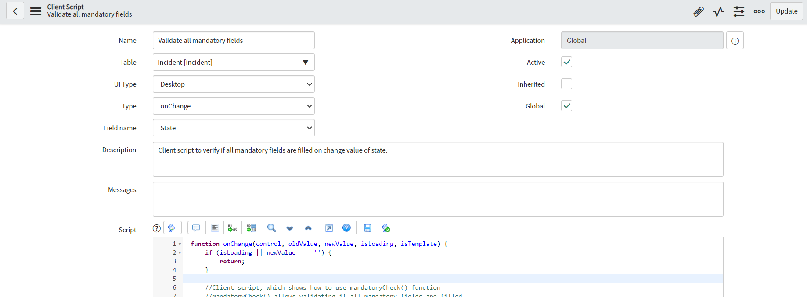
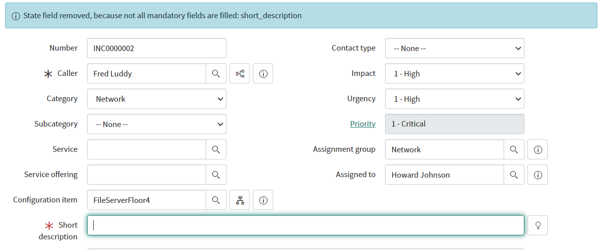

**Client Script**

Client script which is showing how to use g_form.mandatoryCheck() function, which allows to easily detect if any of mandatory field is not filled on record.

**Example configuration**

**Example execution**

