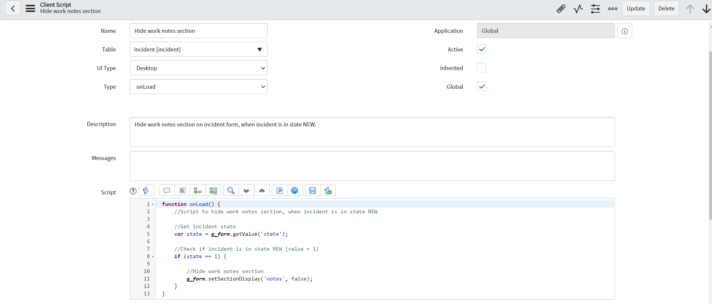
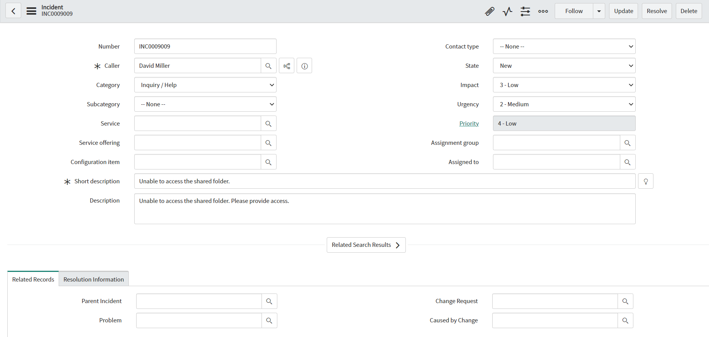
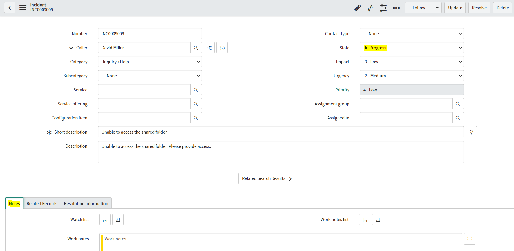

**Client Script**

Client Script for hiding work notes section on incident form. In this example it is configured to hide work notes section, when incident is in state new, but you can adjust condition to fit your requirements. 

**Example configuration of Client Script**

**Example effect of execution**

When incident is in state NEW (Work notes section not visible):

When incident is not in state NEW (Work notes section visible):

