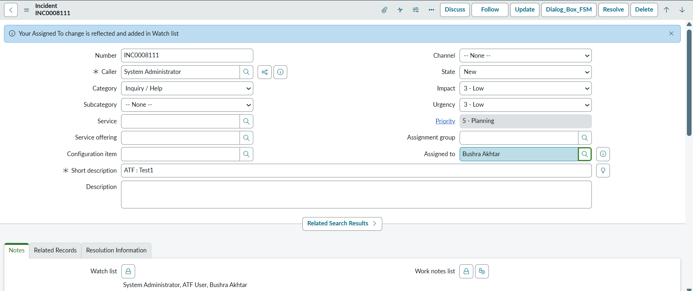

# Assigned To Change – Watch List Update

When the **Assigned To** field changes, this client script updates the **Watch list** to include the **Opened By**, **previous assignees**, and **new assignee**.  
- Help maintains visibility of all users involved in the ticket’s ownership history.  
- Helps track ownership transitions and ensures clarity during assignment change.  
- A confirmation message appears when the change is reflected in the Watch list.  
- Specific script for use in the Incident form in ServiceNow but can be used for other forms too

