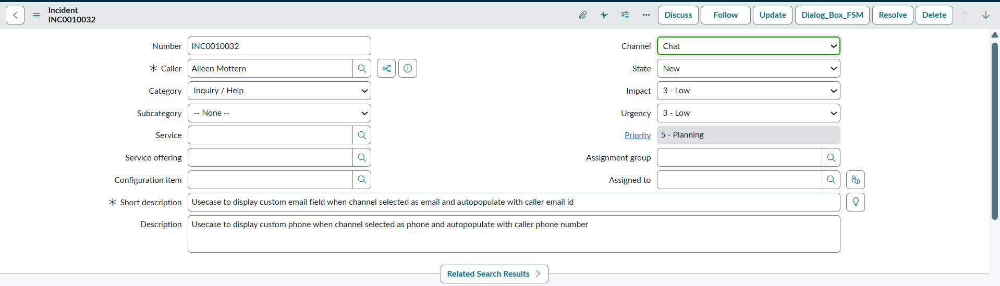
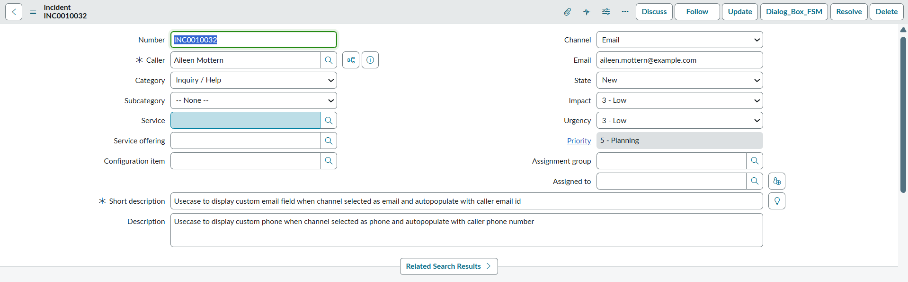
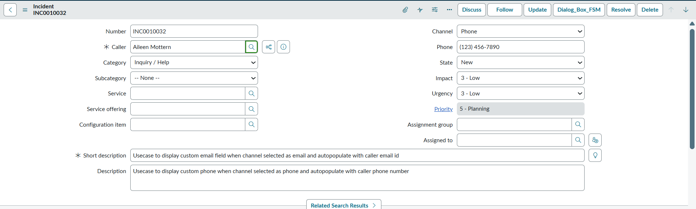

# Display Custom Email/Phone Field Based on Incident Channel Field and Populate those Field with Caller Information

Displays either the **Email** or **Phone** field on the **Incident** form based on the selected **Channel** value (Email or Phone) and populate the fields with the caller’s details.

### Use Case
- When **Channel = Email**, the **Email** field becomes visible and is auto-populated with the caller’s email address  
- When **Channel = Phone**, the **Phone** field becomes visible and is auto-populated with the caller’s mobile number  
- Both details fetched from the caller’s record from **sys_user** table.  
- The custom Email and Phone fields may also serve as placeholder to update if details differ from the caller record

### Prerequisites
- Create Two custom fields on Incident Table
  - **u_email** which captures store the caller’s email address
  -  **u_phone** which capture caller’s mobile number
- Create **Two UI Policies** which hides the u_email and u_phone field unless channel choice is phone or email
- Create an onChange Client Script that calls a GlideAjax Script to fetch the caller’s contact details and populate the custom Email or Phone field on the Incident form
- To further enhance usecase Regex used on Phone field. Refer (https://github.com/ServiceNowDevProgram/code-snippets/pull/2375)
  
---

### Incident Record when channel choice is other than Email or Phone 

---

### Incident Record when Channel choice is email and populate Email Field by caller's Email

---

### Incident Record when channel choice is phone and populate Phone Field by caller's Phone Number

---

