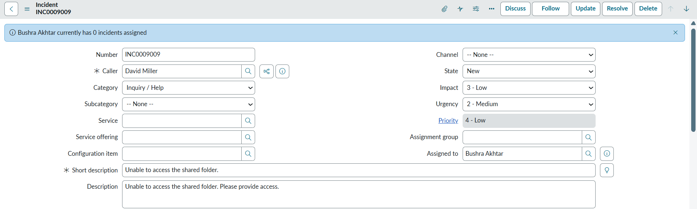
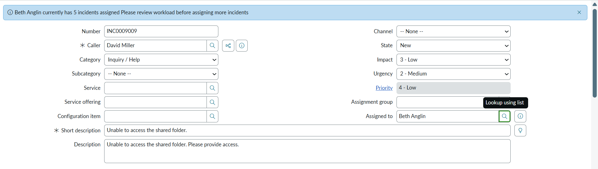

## Display Info Message of Incident Count of Assigned-To User When Field Assigned-To Changes

Displays a message showing the count of **open incidents** assigned to a user whenever the **Assigned To** field changes on the Incident form.  

- Helps assess the assignee’s **current workload** by fetching and displaying active incident counts (excluding *Resolved*, *Closed*, and *Canceled* states)
- Shows an **info message** with the count of the assignee's assigned incidents
- Uses an **onChange Client Script** on the **Assigned To** field and a **GlideAjax Script Include** called from the client script to fetch the count dynamically

---

### Info Message Example 1  

### Info Message Example 2  

---
