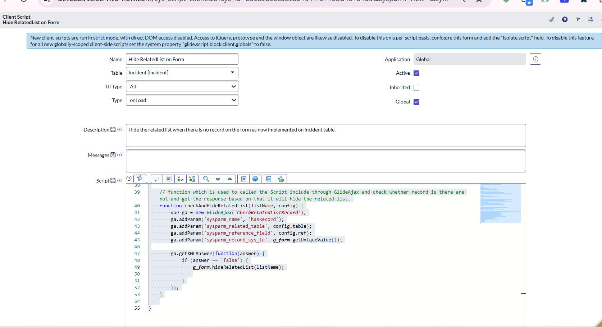
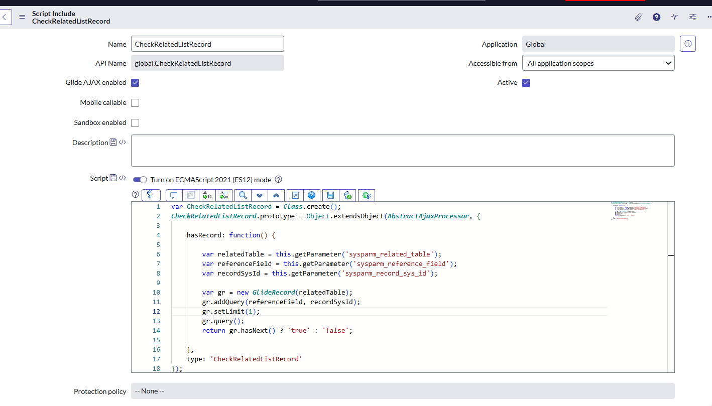

Hide Related List if there is no Record

Script Type : Client Script, Type : OnLoad, Table: incident

Script Type : Script Include, Glide AJAX enabled : True, Role : admin

Goal : Hide the Related list on the form based on the record

Walk through of code : So the Client Script will run on the Onload form so this will check whether the mentioned related list has record or not so based on that this will send the data to the Script include through Glide Ajax and then this Script include will Glide Record to the particular table name and then check whether record/records it there or not based on that this will return 'true' if record is no record else return 'false' means there is a record.

