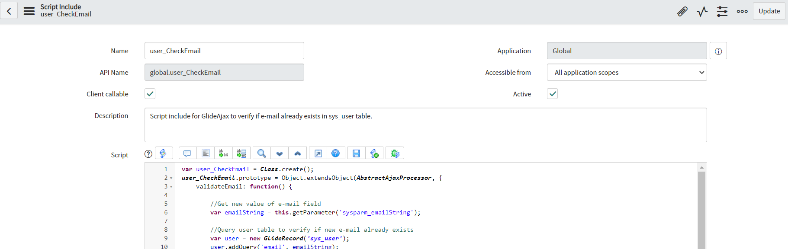
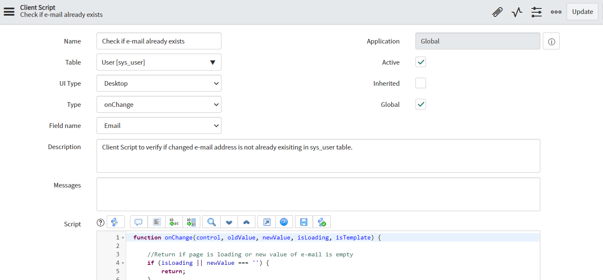
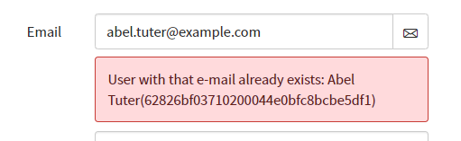

**Client Script**

Client script for verification if changed e-mail adders on user record is not already existing in sys_user table (real-time information about duplicated e-mail). Check is performed using asynchronous Ajax call and processed in callback function. In case e-mail already exists in sys_user table, message is displayed under email field with information which has have that e-mail.

**How to use**

You need to prepare both Script Include (which is processing check on backed) and Client Script (which is sending Ajax call after change on email field and display message).

Example Script Include configuration (code in [scriptInclude.js](scriptInclude.js)):

Example Client Script configuration (code in [clientScript.js](clientScript.js)):

**Example effect of execution**

