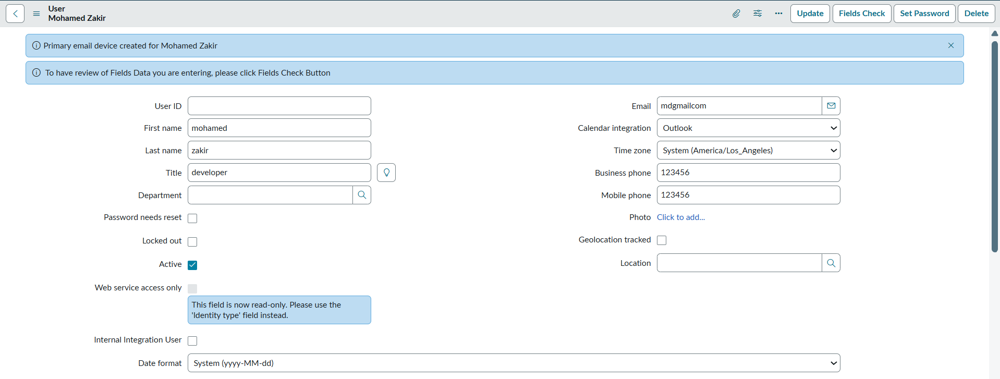
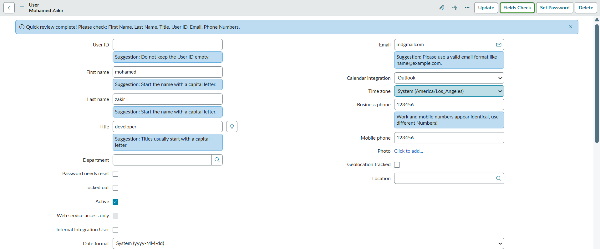
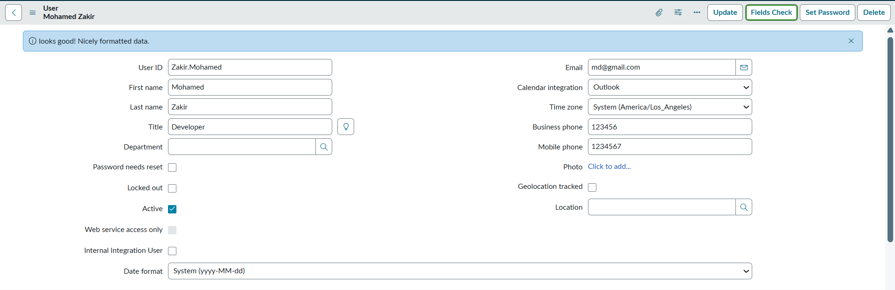

## Field Review of User Record when on form using action button

Displays informational messages suggesting improvements to field formatting on the User Table (**sys_user**) form when the **Fields Check** button is clicked.

- Helps maintain consistency in user data by checking capitalization of names and titles, validating email format, ensuring phone numbers contain only digits, and preventing duplicate phone entries. 
- Also suggests users not to leave the **user_name** field empty.
- Shows Info messages below each field highlighting fields that may need attention.
- Simple Prerequisite is that: when form loads give Info message to check **Field Check** button to bring user's attention
- Uses a Client-side UI Action (**Fields Check**) that to review entered data and display friendly suggestions
  - Name: Fields Check
  - Table: User (sys_user)
  - Client: true
  - Form button: true
  - Onclick: onClickCheckDetails()

---

### Grab user's attention on Field Check Button using Info message at top

---

### After clicking Field Check Button where suggestions are displayed below fields

---

### When user fixes the suggested issues and click the **Fields Check** button again, a message confirms that all fields are correctly formatted

---
