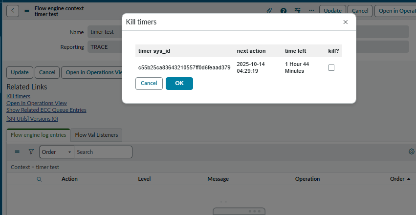

# UI Action to kill flow timers

UI page that shows you all timers that a flow context [sys_flow_context] is waiting for. Shows sys_id of the sys_trigger, the datetime when the wait will finish and how long until that time. Select the checkbox and submit the modal form to kill that timer.

## How to use

1. Create ui action on [sys_flow_context] and input the script from *UI action.js* in the script field. Check client and set Onclick as *openTimerDialog()*
2. Create ui page with name *timer_kill_dialog* and copy the HTML, client script and processing script from the *UI page for ui action.js* file
3. Navigate to active flow context that is waiting for timers and click the ui action from step 1 and kill timer/s. Flow will progress as soon as the flow engine processes the flow.fire events

