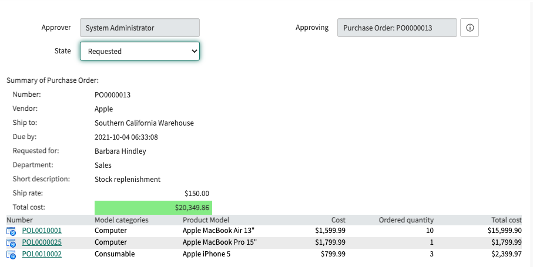

With the [Procurement plugin](https://docs.servicenow.com/bundle/rome-it-asset-management/page/product/procurement/concept/c_Procurement.html) activated, Asset managers can track vendor purchase orders for hardware and software assets. This application does not have approvals built-in by default, but that is a common addition.

When these approvers are also fulfillers, they will likely be approving from the platform rather than via the portal. The included XML is to be used in a UI Macro to show critical Purchase Order data elements so that the approver can approve directly from the approval record without clicking into the PO.

In order to use this script, create a new UI Macro named "approval_summarizer_proc_po" add the full script from the XML file into the XML field. The system will automatically know to now use this macro for Purchase Orders because of the naming convention.

You can also create summarizers for other tables in a similar fashion by creating UI Macros start with "approval_summarizer_" and ending with the database table name.

Below is an example of the Purchase Order details display on an approval recor. It is not the most beautiful, but follows the formatting from similar approval summarizers.

