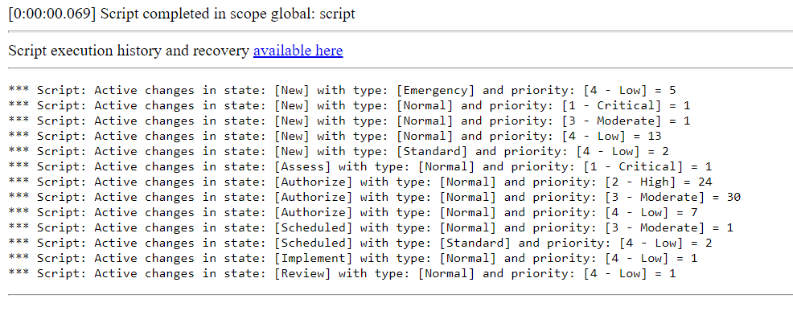

**GlideAggregate**

Script which allows to group by three columns (you can expand or decrease number of columns to fit your needs). In this example, the script allows counting number of active changes grouped by state, type and priority fields.

Special thanks to *SN-AJB* for his post about GlideAggregate: https://developer.servicenow.com/blog.do?p=/post/glideaggregate/. Absolutely worth taking a look!

**Example execution logs**

