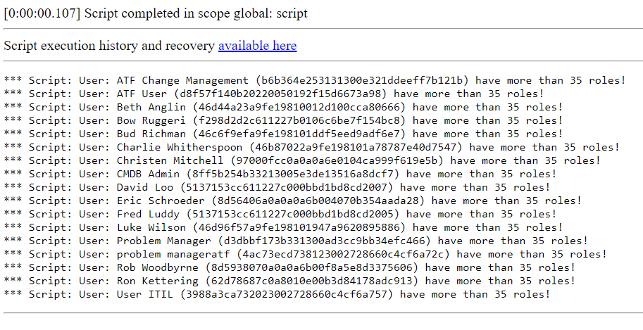

**GlideAggregate**

Script which shows how to use addHaving() function, which allows adding conditions on aggregate functions. In this example, the script will show which users have more than 35 roles assignments in sys_user_has_role table. You can use it also in different scenarios, modifying the table and other conditions.

Function addHaving() can not be used in Scoped Applications!

**Example execution logs**

