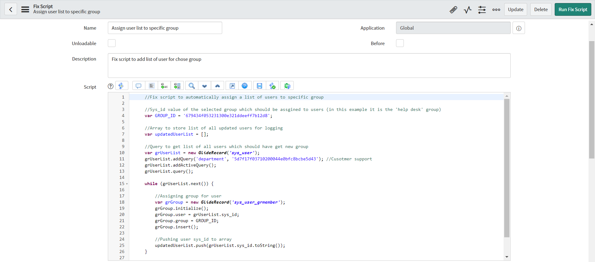
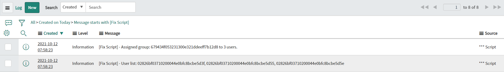

**Fix Script**

Script to *automatically assign a list of users to a specific group*; you can change the user query to prepare a correct list of users according to your needs. To assign a different group, change the value of the GROUP_ID variable to the sys_id of the group which you would like to assign. 

**Example configuration of Fix Script**

**Example execution logs**

