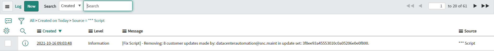

**Fix script**

Fix Script for cleaning update set from customer updates made by a selected developer. Script can be adjusted to match different query for cleaning which fits your needs.

Cleaning customer updates from update set is not removing updates made in system on direct records! It is just removing customer updates from update set to not move it to forward environments. 

**Example configuration of Fix Script**

**Example execution logs**

**Example effect of execution**

Before execution:

After execution:

