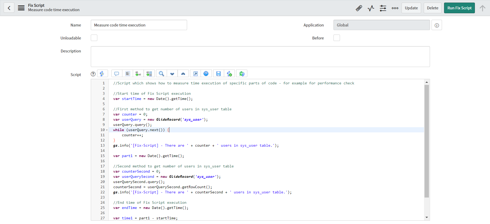
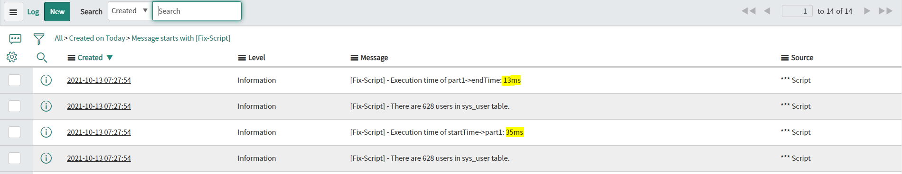

**Fix Script**

Script which is showing how to *measure time execution of specific part of code*. You can use it to check performance of code or track time execution of part of code in Fix Scripts. You can add any amount of measuring parts, based of your needs.

**Example configuration of Fix Script**

**Example execution logs**

