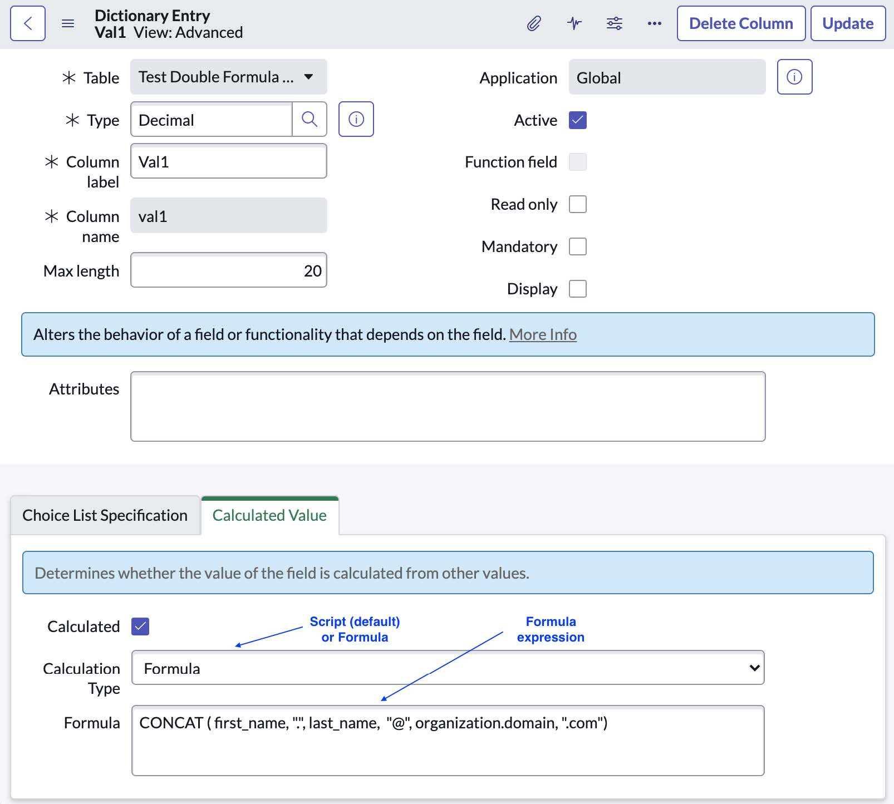
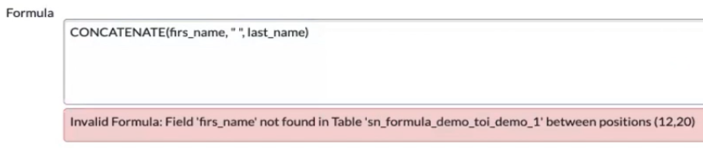

## Formula Builder at a glance

Formula Builder provides a more Excel-like experience in creating calculated fields in Glide tables, *without JavaScript*.

## Benefits of a formula over a script

Not only is it easier to write and read a formula over a script, formulas are more accurate than scripts due to the fact that JavaScript can have problems with floating point arithmetic which can be a big problem for financial calculations. Formulas, which are using arbitrary precision, are more accurate in this way.

## How to use Formula Builder

Formula builder has been added to the existing "Calculated Value" section of a column's dictionary entry.

As a reminder, calculated values in a table column take values from other fields and the result of that computation is what is shown as the field value (similar to how a cell in Excel could contain a formula like `=A1+B1`)

Prior to Tokyo, calculated values were only possible via JavaScript. With the new formula builder, it will be easier to build these formulas and also easier to read.

1. Open a field's dictionary entry
2. Navigate to the "Calculated Value" section/tab
3. Check the checkbox next to "Calculated"
4. Change the "Calculation Type" to `Formula`
5. Build your calculation's formula in the "Formula" field
6. Save your record

If you do not see the "Calculated Value" section/tab, switch to Advanced view via the Related Link UI Action.

## Examples of possible formulas

`CONCATENATE(first_name , ".", last_name , "@", org.name , ".com")` 
Combine the first_name field and the last_name field as an email address.

`LOWERCASE(CONCATENATE(file_prefix, NOW(), ".tmp"))` 
Builds a filename with a prefix, the current date, and a file type, all in lowercase letters

`AVERAGE(SUM(price_1, fuel_1), SUM(price_2, fuel_2))` 
Sums two sets a fields then finds the average of the two

`SUM(MULTIPLY(celcius_temp, 1.8), 32)` 
Calculate Fahrenheit based off of a Celcius field

`TIMEDIFF(user.dob, NOW())` 
Calculate the difference between a user's birthday (notice the dot walked field) and today's date

## Formula components

Formulas can have the following:

- **Functions** like `SUM`, `REPLACE`, `TIMEDIFF`
- **Variables** like column names on the current table. This includes dot walked fields. Note that you should use only column names, not display names.
- **Operators** like `=` (equals), `<>` (not equals), `>` (greater  than), `>=` (greater than or equals to), `<`, and `<=`. Note that arithmetic binary operators (`+`, `-`, `/`, and `*`) are not supported. Instead, you would use the arithemtic functions instead (like `SUM` and `MULTIPLY`)
- **Constants** like `"hello"` (a string) or `24` (a number). While JavaScript can use single quotes, note that string constants here are declared with double quotes only

As a reminder, formulas that contain nested functions work as you would expect in Excel: a function called in a parameter of another function must fully resolve before the parent function can continue.

Let's break down the Celcius to Fahrenheit example above:

`SUM(number1, number2, ...)` 
SUM is the function name, whereas number1 and number2 (and so on) are the function's parameters

`MULTIPLY(number1, number2, ...)` 
Similarly, MULTIPLY is the function name and number1 and number2 are the function's parameters

All together: `SUM(MULTIPLY(celcius_temp, 1.8), 32)`

1. The calculated field attempts to SUM its 1st parameter and 2nd parameter together (in this case, the constant number `32`)
2. The first parameter in the SUM function is another function, MULTIPLY, so the SUM function has to wait now
3. The MULTIPLY function tries to multiply its 1st parameter (the value of the celcius_temp field of this record) and its second parameter (in this case, the constant number `1.8`). The MULTIPLY function has all that it needs to resolve and comes up with an answer.
4. Now that SUM's 1st parameter has resolved, it can now finally resolve itself too.

## Validation too!

- If you misspell a column name, you will receive an "invalid update" error when trying to save the dictionary entry.
- Syntax is validated
- Symbol validation (checking if the field exists)
- Incorrect function names are also validated

Example:

## Available functions

At the time of this post being written:

- `AND` Performs a logical AND operation on the arguments.
- `AVERAGE` Returns the average value of the arguments.
- `CONCATENATE` Joins one or more input strings into a single string.
- `DIVIDE` Returns the quotient value after dividing argument 2 by argument 1.
- `IF` Executes the specified statements based on the Boolean output of the conditional expression.
- `ISBLANK` Finds white spaces or blank values in the string and returns true if there are any.
- `LENGTH` Returns the total number of characters in the input string.
- `LOWERCASE` Converts the input string to all lowercase characters.
- `MAX` Returns the highest value in the specified arguments.
- `MIN` Returns the lowest value in the specified arguments.
- `MULTIPLY` Returns the multiplied value of the arguments.
- `NOW` Returns the current date and time of the instance in ISO format.
- `OR` Performs logical OR operation on the arguments.
- `POWER` Returns the result of the base value raised to the power of the exponent value.
- `REPLACE` Replaces characters in the source string with the characters in the target string.
- `SUBTRACT` Returns the result value after subtracting argument 2 from argument 1.
- `SUM` Returns the sum of all the arguments.
- `TIMEDIFF` Finds difference between 2 dates for Duration field.
- `TITLECASE` Converts the input string to all title case characters.
- `UPPERCASE` Converts the input string to all uppercase characters.

## Other things to note

- Data types are not checked during validation. For example, if you have a number field and your formula returns a string, the result will be an error. An "Unparsable" error label will appear next to the calculated field in form view.
- The list of available functions can be found on the `sys_formula_function` table

## Formula Builder in Table Builder

The same functionality can be utilized in Table Builder. For details, you can visit the [release notes](https://docs.servicenow.com/bundle/tokyo-application-development/page/administer/form-builder/task/add-formula-column-table-builder.html).