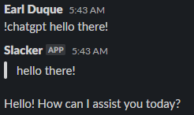

- Make sure you have a key stored in a system property named `openai.key`
- Quick script to do a `gpt-3.5-turbo` chatgpt call
- If you set `show_tokens` to true then it will also show the estimated cost of the prompt+response

Example usage:
