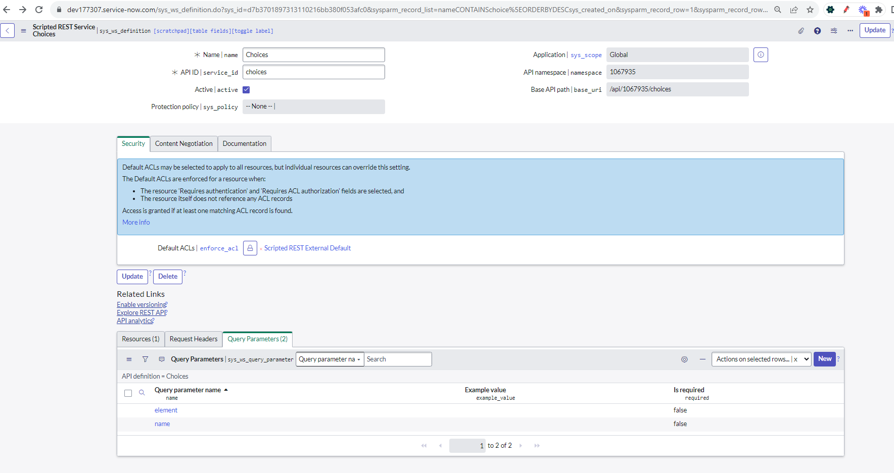
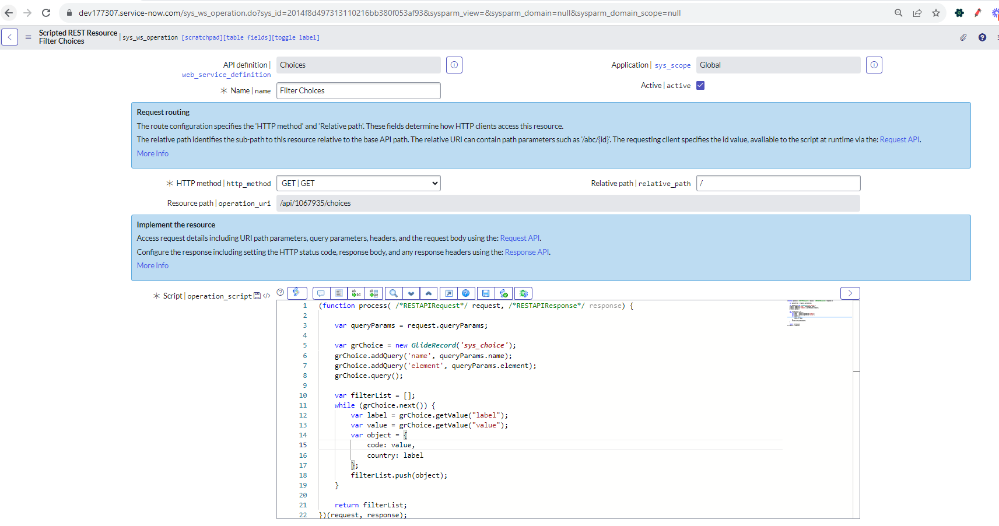

# This code will help to query choice table and get the data according to filter. Modify this according to requirement
# References 
- Below is the reference of PDI, what is the configuration of choices

- Below is the referecnce of PDI resources of Script
