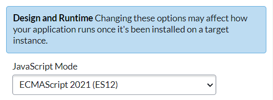

## What?

Prior to the Tokyo Release, ServiceNow's serverside JavaScript utilized ECMAScript 5. "ECMAScript" is basically the version of JavaScript. Newer versions have come out since then (7+ years ago!) and thus, we have been missing out on some helpful functionality.

Client-side scripting is run in your web browser so usually any client script you've made on ServiceNow could utilize the newest JavaScript features, but any script running on the server was limiteded to ES5.

ServiceNow has denoted our version of JavaScript as ECMAScript 2021, which encompasses the feature roll-up of ECMAScript 6 to ECMAScript 12. To see the full documentation of changes, you can see the release notes here: [JavaScript engine feature support](https://docs.servicenow.com/bundle/tokyo-application-development/page/script/JavaScript-engine-upgrade/reference/javascript-engine-feature-support.html). This page has all the new features that are supported, not supported, and disallowed.

## How?

To utilize ECMASCript 2021 on your app, just follow these simple steps:

1. Make sure your instance is upgraded to Tokyo (get a Personal Developer instance [here](https://developer.servicenow.com/))
2. Create a new app via your preferred method (eg. Studio or App Engine Studio)
3. Open the sys_app page for your app<br>
4. Under "Design and Runtime" change "JavaSCript Mode" to `ECMAScript 2021 (ES12)`<br>
5. Save your record. That's it!

## Looking forward

- The new features are available on scoped apps only for now but we've been told that Global scope support is on the roadmap.
- If you switch existing apps to the new engine, we do recommend that you test for functionality and ensure that existing scripts are running correctly.

## Features!

And here are all the scripts that came from the show. **The scripts are all formatted as if they are running in a `Before Update Business Rule` to demonstrate that it works server side**:

### const

This was actually available previously but would display an error to you when using it, despite allowing you to save. Almost everything else related to ECMAScript 6 and up would not allow you to save your record at all.

`const` is a way to declare and initialize a variable that will never change its value. A great way to ensure a variable that is not meant to change never does (your script will throw an error).

```javascript
(function executeRule(current, previous /*null when async*/) {

	var inc_gr = new GlideRecord('incident');
	inc_gr.query();
	var x = inc_gr.getRowCount();
	
	const y = 100;
	current.work_notes = x + y;

})(current, previous);
```

### let

What's the difference between `var` and `let`?

#### Scoping rules

The main difference is scoping rules. Variables declared by var keyword are scoped to the immediate function body (hence the function scope) while let variables are scoped to the immediate enclosing block denoted by { } (hence the block scope).

#### Hoisting

While variables declared with var keyword are hoisted (initialized with undefined before the code is run) which means they are accessible in their enclosing scope even before they are declared

#### Creating global object property

At the top level, let, unlike var, does not create a property on the global object

#### Redeclaration

In strict mode, var will let you re-declare the same variable in the same scope while let raises a SyntaxError.

```javascript
(function executeRule(current, previous /*null when async*/) {

	var inc_gr = new GlideRecord('incident');
	inc_gr.query();
	var x = inc_gr.getRowCount();
	
	let y = 200;
	current.work_notes = x + y;

})(current, previous);
```

### arrow functions

How many times have we googled "how to do ____ in JavaScript?" and the top result was a StackOverflow answer that utilized arrow functions? Arrow functions are a compact alternative to traditional function expressions. Combined with other new features, there are so many use-cases for arrow functions (like quickly reordering arrays of objects!).

```javascript
//before
(function executeRule(current, previous /*null when async*/) {

	var sd = current.short_description;
	var d = current.description;
	
	function addDescriptions(x, y){
		return x + '\n' + y;
	}
	
	current.work_notes = addDescriptions(sd, d);
	
})(current, previous);

//after
(function executeRule(current, previous /*null when async*/) {

	var sd = current.short_description;
	var d = current.description;
	
	let addDescriptions = (x, y) => x + '\n'+ y; //one line!
	
	current.work_notes = addDescriptions(sd, d);
	
})(current, previous);
```

### for/of

A different kind of for/in to add to your arsenal.

```javascript
//before
(function executeRule(current, previous /*null when async*/) {

	var inc_gr = new GlideRecord('incident');
	inc_gr.orderByDesc('number');
	inc_gr.setLimit(10);
	inc_gr.query();
	var incidents = [];
	while (inc_gr.next()){
		incidents.push(inc_gr.getValue('short_description'));
	}
	var work_notes = [];
	for (var inc in incidents){
		work_notes.push(incidents[inc]);
	}
	
	current.work_notes = work_notes.join('\n');
	
})(current, previous);

//after
(function executeRule(current, previous /*null when async*/) {

	var inc_gr = new GlideRecord('incident');
	inc_gr.orderByDesc('number');
	inc_gr.setLimit(10);
	inc_gr.query();
	var incidents = [];
	while (inc_gr.next()){
		incidents.push(inc_gr.getValue('short_description'));
	}
	let work_notes = [];
	for (let inc of incidents){
		work_notes.push(inc); //note that no index reference is needed
	}
	
	current.work_notes = work_notes.join('\n');
	
})(current, previous);
```

### map

The Map object holds key-value pairs and remembers the original insertion order of the keys. Any value (both objects and primitive values) may be used as either a key or a value.

Object is similar to Map—both let you set keys to values, retrieve those values, delete keys, and detect whether something is stored at a key. For this reason (and because there were no built-in alternatives), Object has been used as Map historically.

However, there are important differences that make Map preferable in some cases:

- Accidental Keys (objects initialize with prototype)
- Key types (previously just strings or symbols, now can be functions, objects, any primitive)
- Key Order (simplified to order of entry insertion)
- Size (inherent size property)
- Iteration (objects aren't inherently iterable)
- Performance (additions and removals are more performative)
- Serialization and parsing (object wins in this case)

```javascript
(function executeRule(current, previous /*null when async*/) {

	var inc_gr = new GlideRecord('incident');
	inc_gr.orderByDesc('number');
	inc_gr.setLimit(3);
	inc_gr.query();
	
	const incidents = new Map();

	const keyString = 'a string';
	const keyObj = {};
	const keyFunc = function() {};
	
	inc_gr.next();
	incidents.set(keyString, inc_gr.getValue('short_description'));
	
	inc_gr.next();
	incidents.set(keyObj, inc_gr.getValue('short_description'));
	
	inc_gr.next();
	incidents.set(keyFunc, inc_gr.getValue('short_description'));

	let work_notes = [];
	work_notes.push('map size: ' + incidents.size);
	work_notes.push(incidents.get(keyString));
	work_notes.push(incidents.get(keyObj));
	work_notes.push(incidents.get(keyFunc)); //Finding an a value by providing a function!
	work_notes.push(incidents.get('a string'));

	current.work_notes = work_notes.join('\n');
	
})(current, previous);
```

### set

The Set object lets you store unique values of any type, whether primitive values or object references. Faster, and forces uniqueness of values.

```javascript
const mySet1 = new Set()

mySet1.add(1)           // Set [ 1 ]
mySet1.add(5)           // Set [ 1, 5 ]
mySet1.add(5)           // Set [ 1, 5 ]
mySet1.add('some text') // Set [ 1, 5, 'some text' ]
const o = {a: 1, b: 2}
mySet1.add(o)

mySet1.add({a: 1, b: 2})   // o is referencing a different object, so this is okay

mySet1.has(1)              // true
mySet1.has(3)              // false, since 3 has not been added to the set
mySet1.has(5)              // true
mySet1.has(Math.sqrt(25))  // true
mySet1.has('Some Text'.toLowerCase()) // true
mySet1.has(o)       // true

mySet1.size         // 5

mySet1.delete(5)    // removes 5 from the set
mySet1.has(5)       // false, 5 has been removed

mySet1.size         // 4, since we just removed one value

mySet1.add(5)       // Set [1, 'some text', {...}, {...}, 5] - a previously deleted item will be added as a new item, it will not retain its original position before deletion

console.log(mySet1)
// logs Set(5) [ 1, "some text", {…}, {…}, 5 ] in Firefox
// logs Set(5) { 1, "some text", {…}, {…}, 5 } in Chrome
```

```javascript
(function executeRule(current, previous /*null when async*/) {

	var inc_gr = new GlideRecord('incident');
	inc_gr.orderByDesc('number');
	inc_gr.setLimit(3);
	inc_gr.query();
	
	let incidents = new Set();
	
	while (inc_gr.next()){
		incidents.add(inc_gr.getValue('short_description'));
	}
	
	current.work_notes = incidents.has(inc_gr.getValue('short_description')) + '\n' + incidents.values().next().value + '\n' + incidents.size;
	
})(current, previous);
```

### symbol

Symbol is a built-in object whose constructor returns a symbol primitive — also called a Symbol value or just a Symbol — that's guaranteed to be unique. Symbols are often used to add unique property keys to an object that won't collide with keys any other code might add to the object, and which are hidden from any mechanisms other code will typically use to access the object. That enables a form of weak encapsulation, or a weak form of information hiding.

Every Symbol() call is guaranteed to return a unique Symbol. Every Symbol.for("key") call will always return the same Symbol for a given value of "key". When Symbol.for("key") is called, if a Symbol with the given key can be found in the global Symbol registry, that Symbol is returned. Otherwise, a new Symbol is created, added to the global Symbol registry under the given key, and returned.

```javascript
(function executeRule(current, previous /*null when async*/) {

	var incidents = [];
	let incident = {
		number: current.number,
		short_description: current.short_description
	};
	
	incidents.push(incident);
	incidents.push(incident);
	
	var incidents2 = [];
	incidents2.push(Symbol(incident));
	incidents2.push(Symbol(incident));
	
	current.work_notes = (incidents[0] == incidents[1]) + '\n' + (incidents2[0] == incidents2[1]); //Notice how the first one is true and the second is false, despite all four items being the "same"
	
})(current, previous);
```

### default params

Instead of having to check for included parameters in a function's body, we can do it directly in the parameters now.

```javascript
//before
(function executeRule(current, previous /*null when async*/) {

	function add (x, y){
		if (y == null) y = 'nothing to see here';
		return x + '\n' + y;
	}
	
	current.work_notes = add(current.short_description);
	
})(current, previous);

//after
(function executeRule(current, previous /*null when async*/) {

	function add (x, y = 'nothing to see here'){
		return x + '\n' + y;
	}
	
	current.work_notes = add(current.short_description);
	
})(current, previous);
```

### spread

```javascript
(function executeRule(current, previous /*null when async*/) {

	var inc_gr = new GlideRecord('incident');
	inc_gr.orderByDesc('number');
	inc_gr.setLimit(3);
	inc_gr.query();
	let incidents = [];
	while (inc_gr.next()){
		incidents.push(inc_gr.getValue('short_description'));
	}

	function sum(x, y, z) {
		return x + '\n' + y + '\n' + z;
	}
	
	const incidents_obj = { ...incidents}; //the array's items are "spread" out as parameters
	
	current.work_notes = sum(...incidents) + '\n' + JSON.stringify(incidents_obj);

})(current, previous);
```

### template strings/literals

I love this one because it makes it so much easier to copy and paste multi-line strings into my code. I use this a lot on AdventOfCode challenges!

```javascript
(function executeRule(current, previous /*null when async*/) {

	let x = `hello
	world
	lchh loves you`;
	
	current.work_notes = x; //goodbye \n

})(current, previous);
```

Another way that these are helpful are for templates (Thanks Chris Helming for the suggestion):

```javascript
(function executeRule(current, previous /*null when async*/) {

	const a = 5; 
	const b = 10; 
	current.work_notes = `Fifteen is ${a + b} and not ${2 * a + b}.`;

})(current, previous);
```

### destructuring

Okay, so destructuring is a LOT more than this but here is just an example.

```javascript
const x = [1, 2, 3, 4, 5];
const [y, z] = x;
// y: 1
// z: 2

const obj = { a: 1, b: 2 };
const { a, b } = obj;
// is equivalent to:
// const a = obj.a;
// const b = obj.b;
```

### class

Hoisting differences (functions and classes are both hoisted and declared but classes are not initialized)

```javascript
class Rectangle {
  constructor(height, width) {
    this.name = 'Rectangle';
    this.height = height;
    this.width = width;
  }
}

class FilledRectangle extends Rectangle {
  constructor(height, width, color) {
    super(height, width);
    this.name = 'Filled rectangle';
    this.color = color;
  }
}
```

### And more

That's not all! Go check it out in the docs!

### ES Sources

- https://betterprogramming.pub/difference-between-regular-functions-and-arrow-functions-f65639aba256
- https://developer.mozilla.org/en-US/docs/Web/JavaScript/Reference/