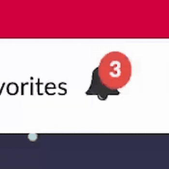

# 🔔 Animated Notification Badge

This snippet demonstrates how to create an animated notification badge using native ServiceNow client-side capabilities, without relying on direct DOM manipulation or inline styles.
It uses AngularJS and CSS to apply a pulsating animation to the badge, ideal for Portal widgets that require attention-grabbing indicators.

## 📦 Files

- `notification-badge.html` – Badge markup with conditional visibility
- `notification-badge.css` – Keyframe animation and badge styling
- `notification-badge.js` – Logic to trigger or reset badge visibility

## 🚀 How to Use

1. Copy the HTML, CSS, and client script into your custom Portal widget.
2. Bind the badge visibility to a condition (e.g., number of unread messages).
3. Use the `animate__pulse` class to trigger attention-grabbing animations.
