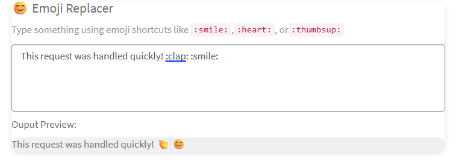

## Emoji Replacer Widget

This widget enhances the user experience by automatically converting emojis code into visual emojis while typing - adding personality and clarity to text communication.
## How It works
- User types in a text box:
- "Great job team!:tada::thumbsup:"
- Script will detects matching emoji code using regex.
- The widget replaces them with real emojis:
- "Great job team!🎉👍
## Available Emoji in Widget
 ":smile:" :😊,
   ":sad:":😓,
	  ":heart:":❤️,
		":thumbsup:":👍,
		":laugh:":😀,
		":wink:":😉,
		":clap:":👏,
		":party:":🥳,
		":tada:":🎉
## Output

