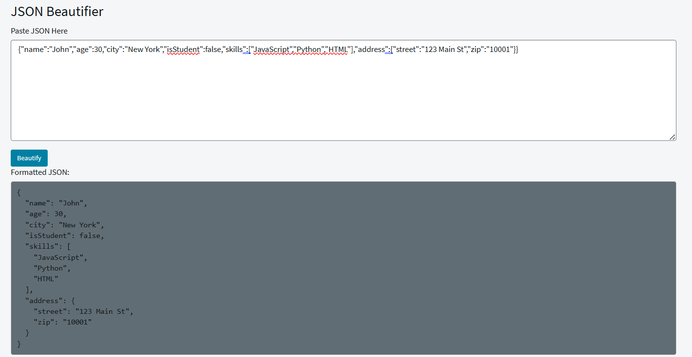

## JSON Beautifier Widget

The JSON Beautifier widget is a developer-focused tool designed to make working with JSON in ServiceNow fast, easy and efficient. It helps admins, developers and testers handles JSON payloads from APIs, Integration etc.

## Benefits
- Reduces time spent manually formatting or checking JSON.
- Helps identify error or differences between JSOn payload quickly
  
## Output

