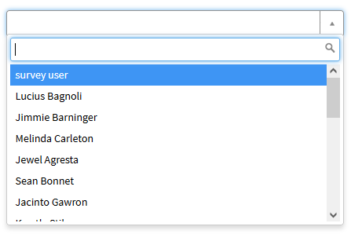
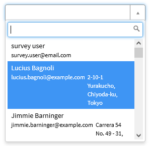
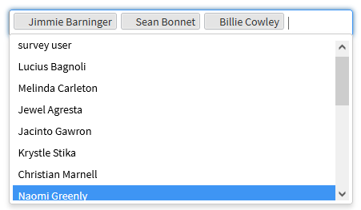

# sn-record-picker
`sn-record-picker` is probably one of the most famous directive that you can utilize in your widgets and use it in situations where you need to have a reference field.

The following table lists all of the scope bindings that can be passed to the directive

| Property      | Description                                                                                                     |
|---------------|-----------------------------------------------------------------------------------------------------------------|
| field         | simple javascript object holding currently selected properties of displayValue, value and name                  |
| table         | specify the table to fetch records from                                                                         |
| defaultQuery  | encoded query that you would like to apply                                                                      |
| startswith    | by default the searching uses `CONTAINS` operator, if specified it will use `STARTSWITH` instead                |
| searchFields  | comma separated list of field names that will be used for searching                                             |
| valueField    | field name that will be used for storing the value, default sys_id                                              |
| displayField  | field name that will be visible for selected record                                                             |
| displayFields | comma separated list of additional fields that can be seen in the dropdown                                      |
| pageSize      | number of records to display in dropdown, additional records will be loaded after scrolling down  , default: 20 |
| onChange      | allows to execute a function when an item from picker is selected                                               |
| snDisabled    | makes the whole picker as readonly                                                                              |
| multiple      | when true, allows to select multiple records                                                                    |
| options       | an object that allows to pass additional config options like `allowClear` and `cache`                           |
| placeholder   | text used if no item is selected                                                                                |


> :warning: For fetching the data, the directive is using the native table API, which respects the ACLs. Make sure the user is able to see all of the required records and fields, otherwise he might experience the picker as a broken with infinite searching indicator.

## Usage example

### Simple user picker


**HTML**
```html
<sn-record-picker table="'sys_user'" field="c.field"></sn-record-picker>

```
**Client controller**
```javascript
c.field = {
    value: '',
    displayValue: ''
};
```

### Displaying additional fields


**HTML**
```html
<sn-record-picker table="'sys_user'" field="c.field" display-fields="'email,location'"></sn-record-picker>

```
**Client controller**
```javascript
c.field = {
    value: '',
    displayValue: ''
};
```

### Multiple selection


**HTML**
```html
<sn-record-picker table="'sys_user'" display-field="'name'" multiple="true" field="c.field"></sn-record-picker>

```
**Client controller**
```javascript
c.field = {
    value: '',
    displayValue: ''
};
```

### Handling change

**HTML**
```html
<sn-record-picker on-change="c.userSelected()" table="'sys_user'" display-field="'name'" field="c.field"></sn-record-picker>

```
**Client controller**
```javascript
c.field = {
    value: '',
    displayValue: ''
};

c.userSelected = function(){
		//TODO
	}
	
```

### Caching data
By passing the special config option, you can cache the results, which can significantly improve any subsequent loading of data.

**HTML**
```html
<sn-record-picker options="c.options" table="'sys_user'" display-field="'name'" field="c.field"></sn-record-picker>

```
**Client controller**
```javascript
c.field = {
    value: '',
    displayValue: ''
};

c.options = {		
		cache: true
	};
	
```