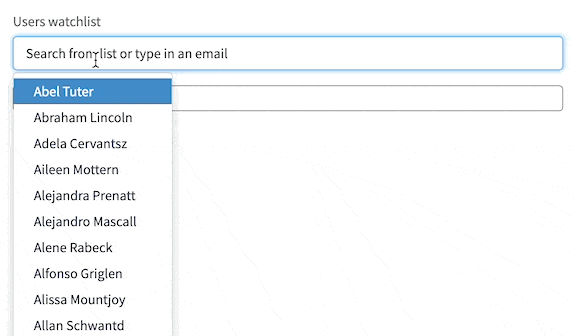

# sn-watchlist

`sn-watchlist` is a custom directive that you can use to create a watchlist like field within your widgets.



| Property    | Description                                                                                                  |
| ----------- | ------------------------------------------------------------------------------------------------------------ |
| placeholder | specify a placeholder for the input                                                                          |
| label       | specify a label                                                                                              |
| ngModel     | allows to bind a model holding a list of seleted users. the user object has properties `sys_id, name, email` |
| ngChange    | expression to execute when the model is changed element                                                      |

## Installation

1. create an angular provider with the name `snWatchlist`
2. paste the content of `snWatchListDirective.js` into the client script field
3. associate the angular provider with the widget where you would like to use it
4. you can now use it as described within [example usage](#example-usage)

> :information_source: for more info visit [docs](https://docs.servicenow.com/bundle/rome-servicenow-platform/page/build/service-portal/task/angular-providers.html)

## Example usage

**HTML Template**

```html
<sn-watchlist
  label="Users watchlist"
  placeholder="Search from list or type in an email"
  ng-model="c.watchlist"
  ng-change="c.watchlistChanged()"
></sn-watchlist>
```

**Client controller**

```javascript
api.controller = function () {
  /* widget controller */
  var c = this;

  c.$oninit = function () {
    c.watchlist = [];
  };

  c.watchlistChanged = function () {
    var watchList = c.watchlist
      .map(function (user) {
        return user.sys_id || user.email;
      })
      .join(",");

    console.log(watchList);
  };
};
```
