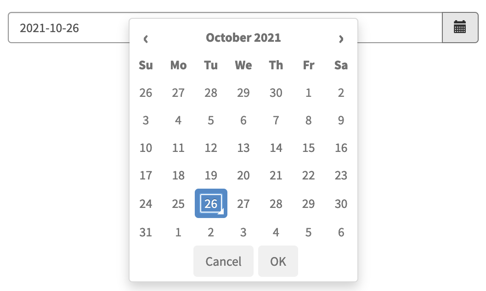

# sp-date-picker



`sp-date-picker` renders a native datetime picker which respects the user's preferred datetime format.

The following table lists all of the scope bindings that can be passed to the directive

| Property      | Description                                                                                                |
| ------------- | ---------------------------------------------------------------------------------------------------------- |
| field         | simple javascript object holding currently selected properties of value, isInvalid and isInvalidDateFormat |
| snDisabled    | makes the whole picker as readonly                                                                         |
| snIncludeTime | when true, allows to select a time as well                                                                 |
| snChange      | allows to execute a function when a new date is selected                                                   |
| snMaxDate     | allows defining maximum possible date selection after that dates are not selectable in the picker          |
| snMinDate     | allows to set minimum possible date selection to the date picker                                           |

> snMaxDate and snMinDate seems to be available after Rome relase

## Usage example

The following example should render a simple date picker that allows user to only select days within the current month.

**HTML**

```html
<sp-date-picker
  field="c.model"
  sn-change="c.dateChanged()"
  sn-min-date="data.minDate"
  sn-max-date="data.maxDate"
></sp-date-picker>
```

**Client controller**

```javascript
api.controller = function () {
  /* widget controller */
  var c = this;
  c.model = {};

  c.dateChanged = function () {
    //TODO
  };
};
```

**Server script**

```javascript
(function () {
  data.minDate = gs.beginningOfThisMonth();
  data.maxDate = gs.endOfThisMonth();
})();
```

The other alternative option would be to use datetimepicker from the [UI Bootstrap library](https://angular-ui.github.io/bootstrap/#!#datepicker) which is already included within the service portal and offers more options and flexibility.
