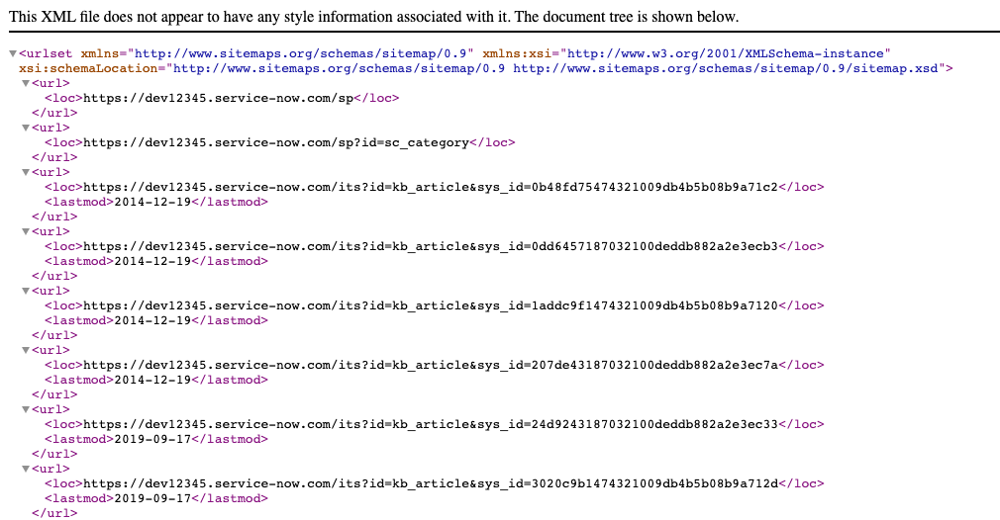

## Intro

For organizations having public-facing service portals, there is often a need to have public content indexed, or crawled, by search engines in order for users to quickly and easily find relevant articles. Building a sitemap is one way of improving SEO by essentially announcing a given list of links that search crawlers should visit.  I will walk you through setting this up in ServiceNow by using a custom Processor.  We will be using the [sitemaps.org](https://www.sitemaps.org/protocol.html) protocol, so feel free to visit the link and get familiar with the XML tags to use.

> **Note**: You will need the **_Custom Search Integration_** plugin activated in your instance, which must be done through a HI request, in order to update Robots.txt - this is necessary for this guide.

## Create a Processor

> **Disclaimer**: Per ServiceNow's [documentation](https://docs.servicenow.com/bundle/orlando-application-development/page/script/processors/concept/c_Processors.html), processors are in fact a deprecated feature.  However, they can still be created and used, at least for now.

Processors allow you to create a customizable URL endpoint that can execute server-side code to produce an output in HTML, JSON, Text, or even XML format.  In this example we will be generating an **XML** sitemap document.

1. Navigate to **System Definition** -> **Processors**, and click **New**
2. Modify the Form Layout to include the **Roles** Field.
3. Enter the following field values for the Processor:
   
| Field | Value |
|-------|-------|
| **Name**  | Dynamic Sitemap |
| **Type** | script |
| **CSRF protect** | false (unchecked) |
| **Roles** | public |
| **Description** | Generate a Dynamic Sitemap from Knowledge Base Articles for SEO |
| **Path** | sitemap |

4. Modify the `dynamicSitemapProcessor.js` script to suit your needs, and enter it in the **Script** field. The comments in the script describe what is being done, so be sure to read them! :)

## Create a Public Page

The next thing to do is to make the new **sitemap** endpoint available to the public so that web crawlers can find it and index your content.  To do this, we need to create a new public page.

1. In the navigator type **sys_public.list** and press enter.
2. Click new, and enter the following field values:

| Field | Value |
|-------|-------|
| **Page**  | sitemap |
| **Active** | true (checked) |

This allows us to navigate to https://<instance>.service-now.com/sitemap.do without being logged in.  Go ahead and try it in a private browser window! You should see something like this if everything works as expected:




## Update Robots.txt

The last thing that needs to be done is to update Robots.txt - this is the file that tells search engines where they are allowed and disallowed from crawling, and also lets you specify the sitemap URL, which is useful when using a non-default URL (the default is /sitemap.xml, and ServiceNow uses /sitemap.do, for example).

> This requires the Custom Search Integration plugin!

1. Navigate to **Custom Search Integration** -> **Robots.txt Definitions**
2. In the **Text** field, enter something like:

```
User-agent: *
Allow: /sp
Allow: /sitemap.do
Disallow: /
Sitemap: https://dev12345.service-now.com/sitemap.do
```

The above **Robots.txt** definition allows crawling of any page under the **/sp** URL, and it allows crawling of the **sitemap**, but it disallows all other crawling from the instance.  Further, we have specified where crawlers can find the **sitemap** by providing the full URL.

It is recommended to either deactivate or use a data preserver on the Robots.txt file in sub-prod instances so that they do not get indexed by search engines.

With this, your instance's public content is now ready to be crawled by search engines!