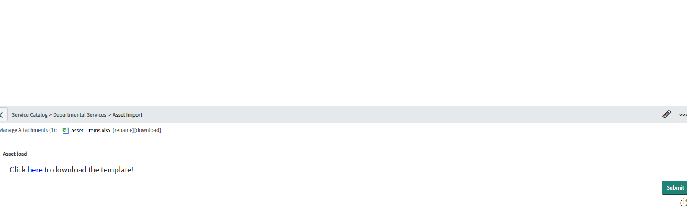

# Create Records importing an excel spreadsheet in the record producer.
The script import the excel spreadsheet in the Data Source table (sys_data_source) and trigger the tranform map, creating the records.

## Configuration
Step 1. Create a Transform Map

Step 2. Add the table name field to "Data Source" and the excel template file 

Step 3. Insert a description with a link to the user download the template

Step 4. Insert the script and change the static fields

Step 5. The users need to drop attach the file and submit the record producer

