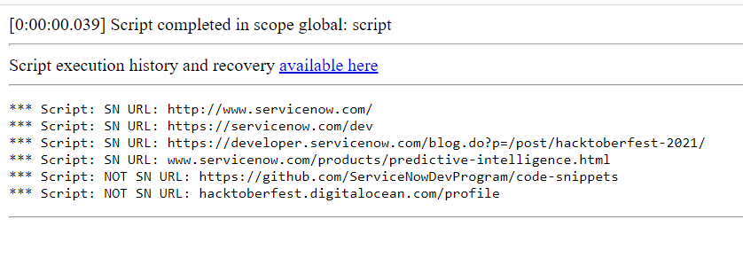

**Regular Expressions**

Regular Expressions, which allows checking if URL belongs to ServiceNow domain. It is verifying all starting prefix like 'https://', 'http://' or just 'www' which belongs to servicenow.com.

You can easily change that regex to different domain, by changing 'servicenow' text in regSN variable.

**Example effect of execution**

 
