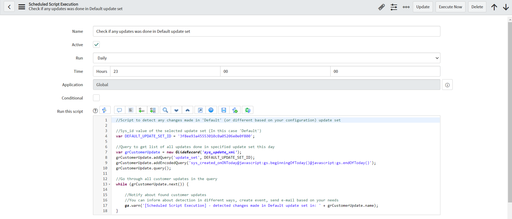
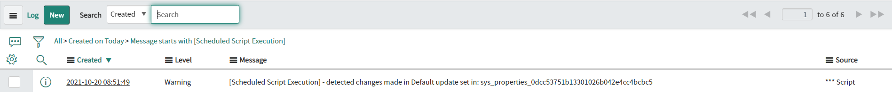

**Scheduled Script Execution**

This script allows detecting any customer updates made in 'Default' update set (on different one based on configuration) in this day. You can change the action after detection from logging, to sending e-mail notification or creating event based on your needs.

**Example configuration of Scheduled Script Execution**

 

**Example execution log**

 
