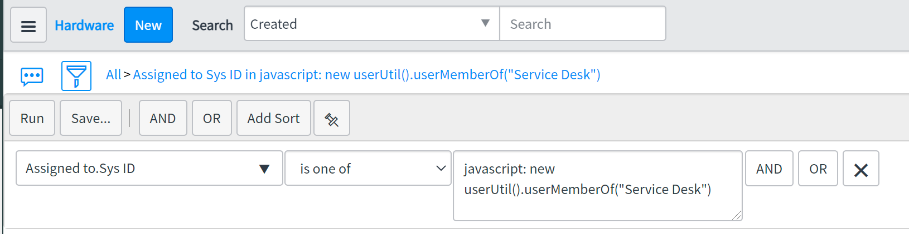

# UserUtil

A collection of scripts related to some esoteric user functions.

## userMemberOf();

The conceit of this function was to filter a list of assets assigned to the _members_ of a specific group. Returns the sys_ids of the group members. The argument passed in should be the display name of the group.

### Example

On a list, in the condition builder, choose **assigned_to.sys_id** (or whatever sys_user field you need), select **is one of** for the operator and enter
`javascript: new userUtil().userMemberOf("Service Desk")` in the **assigned_to** field.

Example Image

## isManager();

Returns true or false if the passed in user has direct reports or not. Useful in ACLs, User Criteria, and various access/UI checks.

### Example

`var manager_check = new userUtil().isManager(gs.getUser()); `gs.info(manager_check);

> False

## getUserAssets()

Returns a comma-separated list of sys_ids for assets belonging to the user. Can be used to retrieve a user's current assets in a workflow for fulfillment activity.

### Example

`var util = new userUtil();`  
`assets = util.getUserAssets(gs.getUserID());`

> 3a3bf7421bdf9c50470a4267cc4bcb35,5e6930081b8f8c94470a4267cc4bcbaa