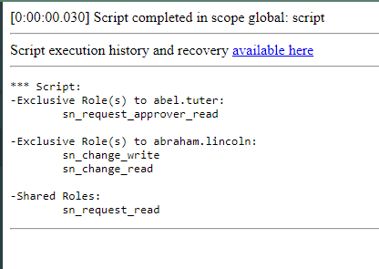

# Compare Roles of Two Users

Provide the usernames of two users and this script will print out the roles they share and the roles they don't share.

> ⚠️ **Note:** ServiceNow provides out-of-the-box functionality for comparing user access via the **Access Analyzer** . You can learn more here: https://www.servicenow.com/docs/bundle/zurich-platform-security/page/integrate/identity/task/comparing-access-controlss**
>
**Parameters:** 
- **includeInheritedRoles:**
  - `false` – only directly assigned roles  
  - `true` – include roles inherited from other roles or groups

- **usernameA**  
  - Username of a `sys_user`

- **usernameB**  
  - Username of a `sys_user`

The script will output:
- Roles exclusive to user A
- Roles exclusive to user B
- Shared roles

## Example Result

