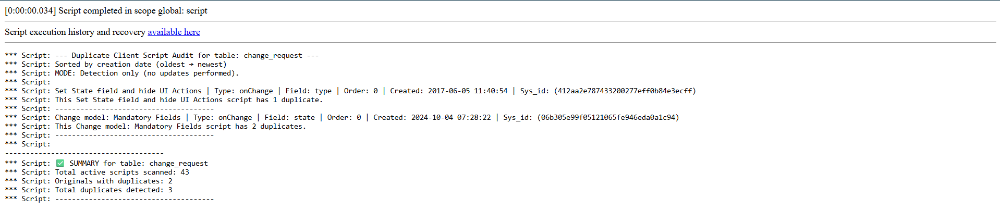
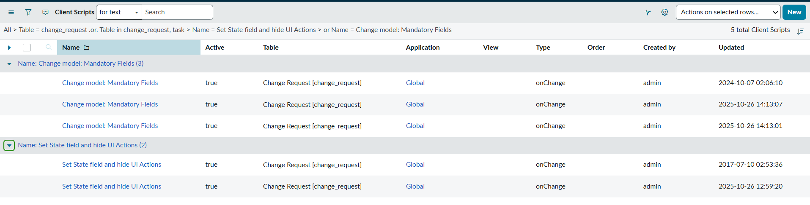
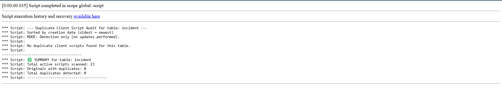

# Duplicate Client Script Audit for Table

Detects duplicate Client Scripts created on a specific table such as Incident, Change Request, or Problem. Helps identify redundant client scripts that share the same configuration.

## Use Case

Every ServiceNow developer Junior or senior has been there, you're building something late at night, testing a client script, and you hit **“Insert and Stay”** instead of **“Update.”**  It looks harmless at first until a few days later, your form starts behaving strangely because multiple client scripts with the same logic are firing at once.
This script was created for exactly that situation:  
- It helps you **find and report duplicate client scripts** on any table, so you can clean them up before they cause issues.
- It scans through active client scripts and highlights cases where multiple scripts:
  - Have the same **name**, **UI type**, **type**, **order**, and **field** (for *onChange* scripts)
  - Exist within the same table
  - Are still **active** in the system
  - By running this audit, you can quickly detect redundant client scripts that may have been unintentionally cloned

### Functionality
Uses a Background Script to:
- Query all active client scripts for the selected table
- Sort them by creation date (oldest to newest)
- Detect duplicates with identical configurations
- Display results as:
  - [ORIGINAL] – first created client script
  - This script has X duplicates – count of newer scripts with the same trigger setup
- If no duplicates are found, a message confirms:
  - No duplicate client scripts found for this table

### Steps to Run

1. Navigate to **System Definition → Scripts - Background**  
2. Click **New**  
3. Paste the provided script and modify this line as needed:
   - var targetTable = 'incident'; // or 'change_request', 'wm_order' etc....
4. Run Script

---

### Example:1 Run The Bacground Script For Change Request Table

---

### Cross Checking The result from output of Script Run

---

### Example:2 Run The Bacground Script For Incident Table

   
