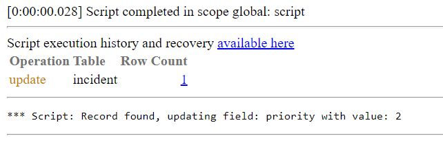

**Background Script**

Background Script, to force update on read only or protected fields. It can be used when it is a need of fixing a value, of field which can not be done from list / form edit. It can be used to any type of table, record and field, need just correct configuration.

**How to use**

You need to fill all four variables which are placed on the begging of the script with values:

- ticketSysId - sys_id value of record which you would like to update
- table - table where this record exists
- field - field which should be forced with new value on record
- value - new value which should be set on record

**Example execution**

Values choosed in this example: 

Execution log:

Execution effect on incident record

