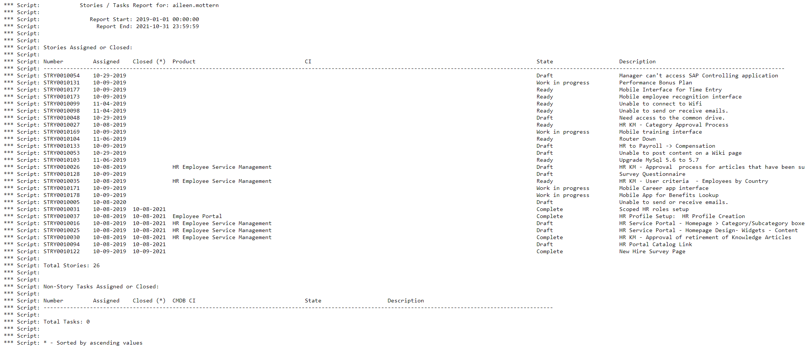

# List Stories and Tasks by User / Date Range

This script is nice for those who love playing with background scripts.  The script can be configured with a user ID and a start/end date range, and will list all stories or tasks assigned or closed during that period for the given user.

## Running the Script

1. Update the variables `userName`, `startDate`, and `endDate` to meet your requirements.
2. Navigate to `Scripts - Background` and copy/paste the contents of `script.js` into the editor, and click **Run script**

## Example of Results

You will be presented with output such as:

