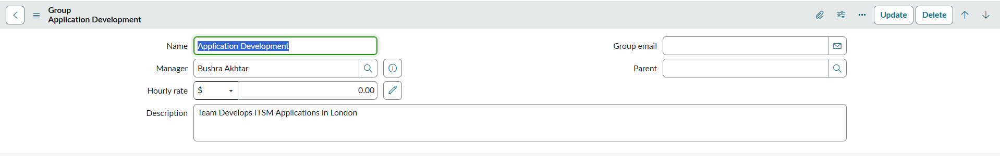

## Reassignment of Manager from Group and User Tables to New Manager for Outgoing/Retiring Manager

Automatically reassigns all groups and users managed by a retiring manager to a new manager and deactivates the outgoing manager’s **sys_user** record.

- Ensures transition by updating manager references in both user and group tables before disabling the old manager’s access.  
- Uses a Background Script to perform the following actions:
  - Updates all groups where the old manager is assigned   
  - Updates all users reporting to the old manager by new manager 
  - Make old manager’s user record inactive in **sys_user** record

### Prerequisites :
- Keep old manager's and new manager's sys_ids ready
- Navigate to System Definition → Scripts - Background
- Click New and paste the script. In the script Replace with your requirement: 
  - var oldManagerSysId = `<Include sys id of old Manager >`
  - var newManagerSysId =  `<Include sys id of New Manager >`
- Run Script

---

### Example Of Group Table Record Before Script Execution 

---

### Background Script Execution 

---

### Example Of Group Table Record After Script Execution

---
