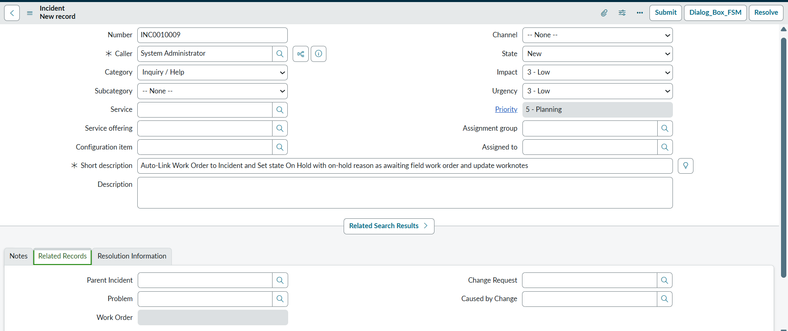
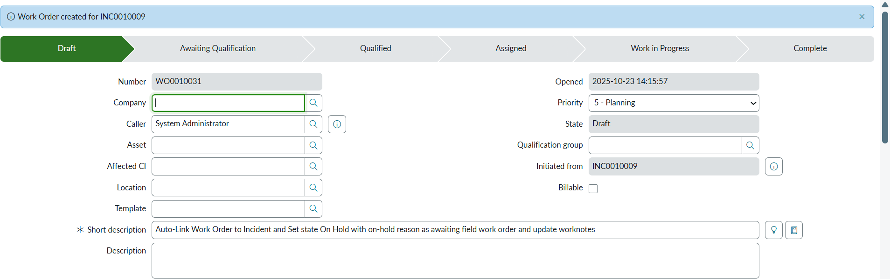
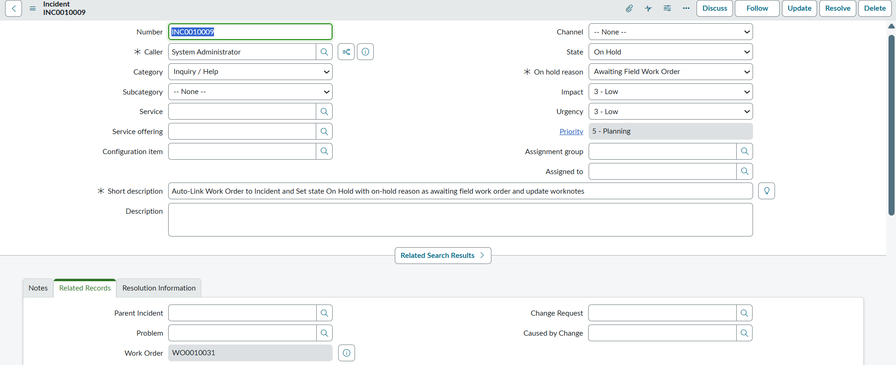

# Automatically Populate Incident with Work Order Number, State , OnHold Reason using business rule

This use case automates the linkage between **Work Orders** and **Incidents** in ServiceNow. When a **Work Order** is created from an **Incident**, the system automatically :
- Populates the Work Order reference (**u_work_order**) field on the parent Incident  
- Sets the **Incident State → On Hold**  
- Updates the **Hold Reason → Awaiting Field Work Order**  
- Adds a **work note** in the Activity Stream for traceability  

This ensures a seamless connection between **ITSM** and **Field Service Management (FSM)** processes, allowing  to identify related Work Orders without navigating to related lists.

## Why This Use Case
Out-of-the-box (OOB) ServiceNow does **not** include a direct Work Order reference field on the Incident form.  
By default, users can only view Work Orders under the *Related Tasks → Work Orders* section, which limits quick visibility.  

To address this gap, a custom reference field (**u_work_order**) was created under the **Related Records** section ( similar to *Problem* or *Parent Incident* ).  
- Displays the linked Work Order number directly on the Incident form    
- Prevents manual modification while maintaining clear visibility for agents  

## Process Alignment
In standard ITSM workflows, Incidents can be placed **On Hold** for reasons such as *Awaiting Problem*, *Awaiting Change*, or *Awaiting Vendor*.  Since there was no default option for Field Service, this customization introduces a new Hold Reason : **Awaiting Field Work Order**

When a Work Order is created from an Incident:
- The Incident automatically moves to **On Hold**  
- The **Hold Reason** updates to *Awaiting Field Work Order*  
- A **work note** logs the Activity Stream  

This behavior aligns with existing ITSM hold logic for Problem and Change processes

## Prerequisites

#### Ensure FSM Application Plugin is Installed
- This customization requires the Field Service Management (FSM) plugin to be installed and active in ServiceNow instance  
- Search for Field Service Management plugin **com.snc.work_management** and install
- FSM provides the **Work Order [wm_order]** table
  
#### Create a Custom Field on the Incident Table
- Create Custom Reference Field on Incident table with label name **Work Order** [u_work_order] and select Type as **Reference**   
- Reference to Table Work Order [wm_order]  
- Save and add this field to the **Incident form** under the **Related Records** section

#### Add Custom Choice in On Hold Reason Field
- Navigate to hold_reason field on Incident table
- Configure dictionary and add **Awaiting Field Work Order** with value set as 2 and sequence as 5  
- Save the new choice to make it selectable in the *Hold Reason* field.

---
### Creating an Incident

---

### Work Order Created from Incident

---

### Incident Updated with Work Order Reference, State On Hold, and Reason Awaiting Field Work Order

