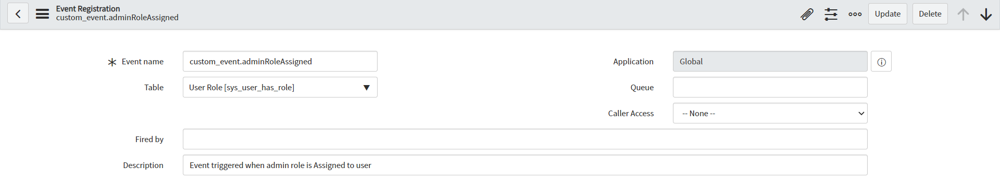
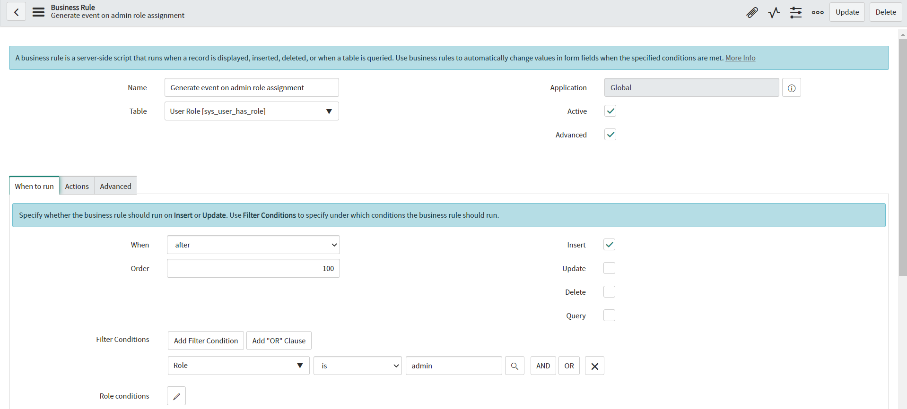
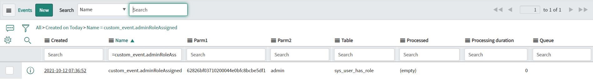

**Business Rule**

Script to *generate new custom event*, which can be used on any conditions, on insert/update/delete of a record. In this example Business Rule is configured to generate custom event when any user get 'admin' role. 

**Event Registration**

Before you can generate custom event from script, you need to add Event Registration record *(sysevent_register table)*. Example Event Registration configuration:

**Example configuration of Business Rule**

**Example execution effect**

