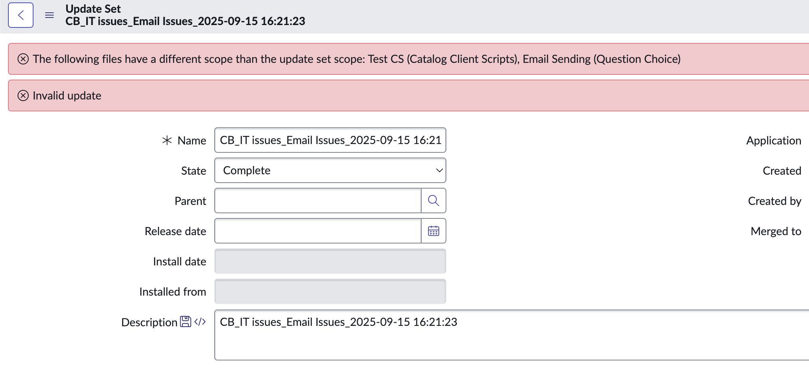

# Business Rule: Validate Update Set Scope


## Challenge

When working with update sets, mismatched scopes can lead to issues during the preview process in the target instance. This often results in errors that require manual intervention to resolve. Such errors can be time-consuming, especially for minor mismatches that could have been identified and prevented earlier. This challenge highlights the need for a mechanism to validate update set scopes before completion, saving time and effort during deployment.


## Overview
This business rule ensures that all customer updates within an update set match the application scope of the update set. If any updates have mismatched scopes, the business rule restricts the completion of the update set and displays a message listing the files with mismatched scopes.

## Features
- Validates the scope of all updates in an update set.
- Prevents the completion of an update set if scope mismatches are detected.
- Displays a detailed message listing the files with mismatched scopes.

## Use Case
This business rule is useful for ensuring that updates in an update set adhere to the correct application scope, preventing potential issues caused by scope mismatches.

## Implementation

### 1. Create the Business Rule
1. Navigate to **System Definition > Business Rules** in your ServiceNow instance.
2. Click **New** to create a new business rule.
3. Configure the business rule as follows:
    - **Name**: Validate Update Set Scope
    - **Table**: `sys_update_set`
    - **When**: Before
    - **Insert**: False
    - **Update**: True
    - **Delete**: False

### 2. Add the Script
Use the following script in the **Script** field:

```javascript
(function executeRule(current, previous /*null when async*/) {

	// Add attached code here
 
})(current, previous);

```

### 3. Test the Business Rule
1. Create an update set and add updates with different scopes.
2. Attempt to complete the update set.
3. Verify that the business rule prevents completion and displays the appropriate error message.


## Screenshots

