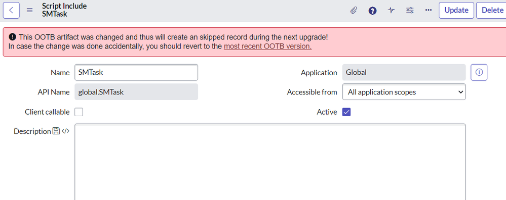

# Description

Changing OOTB artifacts like Script Includes or Business Rules is never a good idea, as you will get so called skipped records in the next upgrade/patch you have to care about. Otherwise, you can get into big trouble and risk broken functionalities as well as unpredictable behavior. But many developers are not aware about the consequences when playing around with OOTB artifacts or have no idea about how to revert the changes (see https://support.servicenow.com/kb?id=kb_article_view&sysparm_article=KB0993700 if you don't know how).

Therefore I implemented the Busines Rule "Warn for changed OOTB artifacts" which displays a warning when opening a modified OOTB artifact. The warning message also provides a link to the most recent OOTB version, where you will find a UI Action for reverting to that version.

# Business Rule

The JavaScript code of the Business Rule is written in way that be also used with a scoped application.

**Table:** `sys_metadata`

**When:** display

# Result

