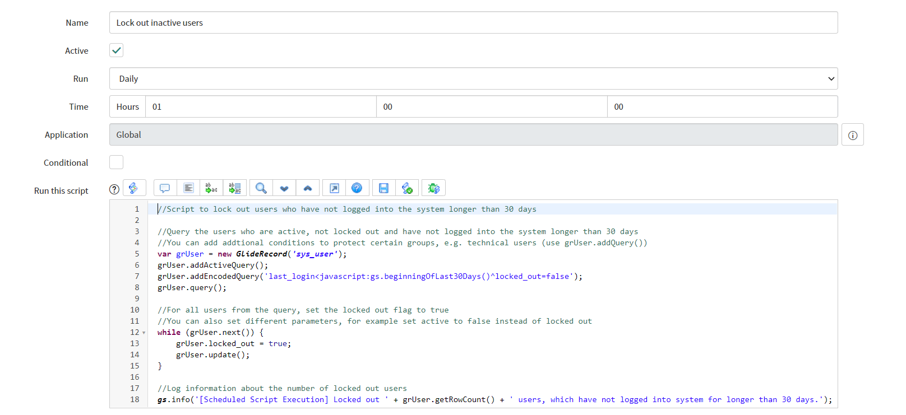

**Scheduled Script Execution**

This script allows to *lock out* users who have not logged into the system for *longer than 30 days*. You can customize the additional query parameters and change the current ones for example in order to shorten or enlarge the time period. 

**Example configuration of Scheduled Script Execution**
 

**Example execution log**
 
