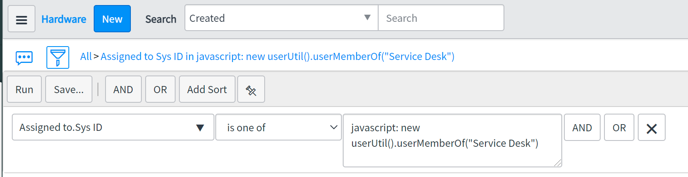

# UserUtil

A collection of scripts related to some esoteric user functions.

## userMemberOf();

The conceit of this function was to filter a list of assets assigned to the _members_ of a specific group. Returns the sys_ids of the group members. The argument passed in should be the display name of the group.

### Example

On a list, in the condition builder, choose **assigned_to.sys_id** (or whatever sys_user field you need), select **is one of** for the operator and enter
`javascript: new userUtil().userMemberOf("Service Desk")` in the **assigned_to** field.

Example Image


## isManager();

Returns true or false if the passed in user has direct reports or not. Useful in ACLs, User Criteria, and various access/UI checks.

### Example

`var manager_check = new userUtil().isManager(gs.getUser()); `gs.info(manager_check);

> False

## getUserAssets()

Returns a comma-separated list of sys_ids for assets belonging to the user. Can be used to retrieve a user's current assets in a workflow for fulfillment activity.

### Example

`var util = new userUtil();`  
`assets = util.getUserAssets(gs.getUserID());`

> 3a3bf7421bdf9c50470a4267cc4bcb35,5e6930081b8f8c94470a4267cc4bcbaa


## getUserEmail()

Returns the email address of the user based on the provided user ID. This can be useful for sending notifications or for logging purposes.

### Example

`var util = new userUtil();`  
`var email = util.getUserEmail(gs.getUserID());`  
`gs.info(email);`

> user@example.com

## getUserDepartment()

Returns the department name of the user based on the provided user ID. This can be useful for departmental reporting or access control.

### Example

`var util = new userUtil();`  
`var department = util.getUserDepartment(gs.getUserID());`  
`gs.info(department);`

> IT Department

## getCompanyUsers()

Returns a list of users from a specified company who have a specific role. This can be useful for generating reports or managing user access based on company and role.

### Example

```javascript
var util = new userUtil();
var users = util.getCompanyUsers('company_sys_id', 'role_name');
gs.info(JSON.stringify(users));
```

> [{"email":"user1@example.com","firstName":"John","lastName":"Doe","roleName":"role_name"}, {"email":"user2@example.com","firstName":"Jane","lastName":"Smith","roleName":"role_name"}]

## emailValidation()

Validates if the provided email exists in the system and returns the user details. This can be useful for form validations or user verifications.

### Example

```javascript
var util = new userUtil();
var user = util.emailValidation('user@example.com');
gs.info(user);
```

> {"email":"user@example.com","firstName":"John","lastName":"Doe"}
