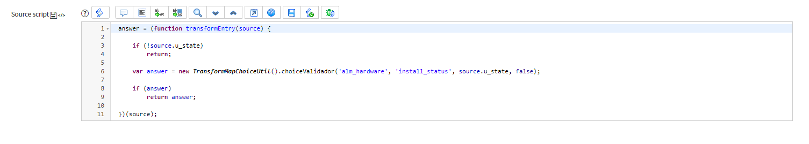

# **Choice Field Validator**

Function that returns the value of a choice by its display value. Initially created to be used in field map scripts.
Used to return the choice even if the instance is in different language.

## *Important points*
- It is imperative that the display value in the transform map table exists in the instance
- It is possible to validate the values of choices dependent on other choices
- To get the dependent choice you need set and static value or run the function for the first choice and then with the dependent choice (as in the second example).

## **Example configuration**

1. Category validation:

2. Category and subcategory validation:

In these previous cases we used the validator because some users use Portuguese language and all options in the excel are in English. With the functions we don't need to worry about the different languagues.

